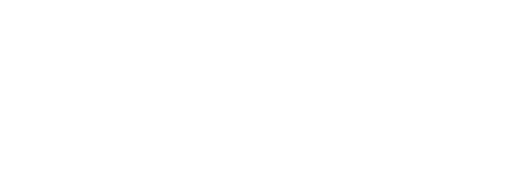
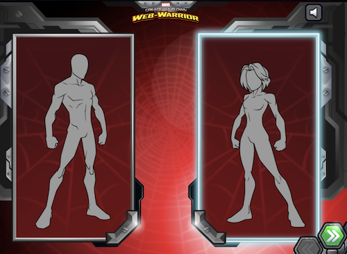

##  {.separator}

<h1>Welcome to React Development</h1>

<aside class="notes">

* Overview
This lesson serves as the kick-off for your React Development course. Whether you’re delivering this course online or in person, in a 1-week, accelerated or 10-week, part-time format, take the first hour or so of your time together to start things off on the right foot.

This lesson is designed to introduce yourself and GA and get the students comfortable and excited to learn. After that, there's a brief review of the pre-work.

* Learning Objectives
In this lesson, students will:
- Define class expectations and norms.
- Understand key concepts introduced in the pre-work.

* Duration
60 minutes

* Before Class: Preparation
- Update the following slides with specific information about you, your class, your city, and your local support team.
- Take some time to consider your expectations for learners, and be prepared to talk about them.
- Choose an "ice breaker" to run that will allow learners to get to know one another in a fun, informal, low-stakes way. We have a list of activities [here](https://docs.google.com/presentation/d/1a91IqhzijI_3EqU-trJbZN4vDDSU0rXqgIrqGwsWM7I/edit) for you to choose from (as well as other good slides to copy). If you have some good ones, feel free to share your ideas with us!
- Before class, review completion data to understand how far your learners have progressed through the myGA pre-work.
-- If most of your learners have completed the pre-work, you should be able to breeze through this lesson very quickly.
-- If most of your learners have not completed all of the pre-work, you might want to spend more time on this lesson and reduce your timings for the rest of the lessons in Unit 1.

* In Class: Materials
- Projector
- Internet connection
</aside>

---

## Agenda

*Here's what we'll cover:*

- Instructional team and classmate introductions.
- About General Assembly.
- Course structure.
- The final project.
- Key concepts from the myGA pre-work.

<aside class="notes">

**Talking Points**:

- Welcome!
- What questions do you have about the agenda for this lesson?

</aside>

---

## Meet Your Instructor

**{Insert your name}**

- {Insert your email address.}
- {Insert key facts about yourself and your career.}
- {Insert your current role.}
- {Insert cool companies/brands you’ve worked with.}
- {Insert one fun fact about you.}

<aside class="notes">

**Talking Points**:

- Talk about the instructor’s role as the instructional team “lead.”

</aside>

---

## Meet Your Support Team

**{Insert IA's name}**

- {Insert IA's email address.}
- {Insert key facts about IA and IA's career.}
- {Insert cool companies/brands IA hopes to work with.}
- {Insert one fun fact about IA.}

<aside class="notes">

**Teaching Tips**

- Duplicate this slide for each IA or classroom member you want to introduce.

</aside>

---

## Front Lines

Have a question about:

- The campus?
- Lost and found?
- Loaner equipment?
- Free coffee and snacks?

Come here to talk to Front Lines and they will help you out.

{Picture of the local Front Lines desk.}

<aside class="notes">

**Teaching Tips**:

- Introduce anyone here; see the next slide for a template.

</aside>

---

## More Great People

{Bulleted list of names and roles}

<aside class="notes">

**Teaching Tips**:

- These are common faces on campus that students should know about.

</aside>

---

## Classroom Culture

Let’s all agree to:

- Treat each other with respect.
- Avoid bringing distractions into class.
- {Add more…}

<aside class="notes">

**Talking Points**:

- Add any rules you'd like to here.

</aside>

---

## More Great People: You! Meet Your Classmates

Please share:

- Your name.
- Why you’re taking this course.
- Your favorite website or app.
- Three things that were on your bedroom wall when you were a teenager.

<aside class="notes">

**Teaching Tips**:

- Feel free to swap these out for your preferred ice breaker questions. The following is an ice breaker activity; you could do that instead of (or in addition to) these questions.

</aside>

---

## Ice Breaker

Create Your Own Web Warrior

- You have five minutes to create your coder alter ego: https://www.marvelhq.com/create-your-own-super-hero.

- When you are finished, share your avatar with a partner. Why did you make your particular choices? What is your superpower when it comes to web development? What is your Kryptonite?

<aside class="notes">

**Teaching Tip**:

- Feel free to swap this out for your preferred ice breaker activity. You can use the ice breaker questions on the previous slide instead of (or in addition to) this activity.

- Alternate ice breaker: Have students make their own meme (https://imgflip.com/memegenerator) that captures how they feel about taking this class. Then, have them share and present their memes.

</aside>

---

## What Is General Assembly?

- More than 20 global campuses across 6 countries.
- A thriving alumni community of 50,000+ full- and part-time graduates.
- Corporate training with 350+ companies, including more than 40 of the Fortune 100.
- 500,000+ attendees at bootcamps, workshops, and events.

<aside class="notes">

**Teaching Tips**:

- Go through this section quickly. Students have probably heard this information before in info sessions or via the GA website.

</aside>

---

## What Is General Assembly's Mission?

<h3>"GA was founded on the principle of empowering people to pursue the work they love. Since we opened our first campus in 2011, we have had the privilege of working with students, governments, and the world’s largest companies to create opportunities to radically transform careers and economic prospects."</h3>

 — Jake Schwartz, Founder + CEO, General Assembly

<aside class="notes">

**Teaching Tips**:

- Rather than reading the quotation out loud, take this opportunity to share with students your own reasons for being part of GA’s mission.

</aside>

---

## Student Experience

Come work on campus!

We’re open:

- {8am - 10pm, Monday to Friday}
- {10am - 6pm, Saturday and Sunday}

<aside class="notes">

**Teaching Tips**:

- If this is the 6-day, full-time format, delete this slide; students won't need to take advantage of this.

</aside>

---

## Map of the Campus

{If possible; otherwise, remove this slide.}

<aside class="notes">

**Talking Points**:

- Point out restrooms, Front Lines, the classroom, the kitchen, and where they could come work (if that slide is left in).

</aside>

---

## Snack Calendar

There’s a lot of work ahead, and you’re going to need fuel.

{Link to snack calendar.}

<aside class="notes">

**Teaching Tips**:

- Remove this slide if there are no snacks available.

</aside>

---

## Moving On to Course Specifics...

OK, we know that GA is cool!

And your classmates are cool.

Now, let's talk about the course.

<aside class="notes">

**Teaching Tips**:

- Transition from talking about GA in general back to talking about the React course.

</aside>

---

## Computer Setup

In this course, you'll need:

- A Mac, PC, or Linux machine.
- Access to the internet.
- Slack.

*WiFi: GA-GUEST*
*pw: yellowpencil*

<aside class="notes">

**Teaching Tips**:

- Make sure all students are set up on Slack and connected to the network.
- Change the WiFi information if needed!

</aside>

---

## Office Hours

Help us help you!

{Mondays / Wednesdays}:
{5:30pm - 6:30pm}

<aside class="notes">

**Teaching Tips**:

- You won't have these in the 6-day delivery! (Delete this slide if so.)

</aside>

---

## How to Get a Certificate of Completion

1. Complete 80% of the homework.
2. Don’t miss more than three classes.
3. Complete the final project.

<aside class="notes">

**Teaching Tips**:

- This slide details how to get a certificate of completion. If anything is different, change it!

</aside>

---

## Course Materials

Lecture decks and activity prompts can be downloaded as PDFs. However, you are encouraged to take your own notes throughout the course.

<aside class="notes">

**Teaching Tips**:

- Modify the slide as needed to suit your preferences for material sharing.
- If you're using Heroku, you can set up a landing page with links to materials you will share out.

</aside>

---

## Homework

  - Homework isn't graded but serves as good practice.
  - We will review assignments in class the day they're due.

---

## Your Final Project

- Each day, you’ll build skills in React and understand different ways in which you can use it to build applications.
- At the end of {Day 4 or the ninth week}, you’ll choose a final project focus.
- On {Day 5 or the 10th week}, you’ll build an application in React in class based on your project focus area.
- At the end of {Day 5 or the 10th week}, you’ll demo your project for the class.

<aside class="notes">

**Teaching Tips**:

- Explain details of the final project, {updating this slide to reflect your own expectations if needed}.
- Encourage students to be thinking throughout the course about what they want to build.
</aside>

---
## Some Key Features of React

- Declarative views: They make your code more readable and easier to debug.
- Virtual DOM: A virtual copy of the original DOM. Manipulating it (over the original DOM) speeds things up.
- Event handling: No need to worry about incompatible event names and fields.
- JSX: Markup syntax you'll use for generating strings of HTML that are almost identical to the HTML you'll insert into the webpage.
- Component-based: In React, everything on the webpage is divided into small components to create a view (or UIs).
<aside class="notes">

**Talking Points**:

- On this and all following slides, don't just read the text; add in your own experience and thoughts.

</aside>

---

## When to Use React

- If your project involves many components with different, often-changing states (e.g., active/inactive navigation items, accordion sections expanded/collapsed, dynamic inputs, buttons active/disabled, user login and access permissions).

<aside class="notes">

**Talking Points**:

- If you know of any specific examples, talk about them!

</aside>

---

## When NOT to Use React

Other programming languages exist; React isn't great for everything! Avoid using React with:

- Devices with limited hardware capabilities.
- Webpage widgets such as Botsplash Chat that are installed on third-party websites.

<aside class="notes">

**Talking Points**:

- If you know of any specific examples, talk about them!

</aside>

---

## Q&A and Summary

What other questions do you have?

<aside class="notes">

**Talking Points**:

- Check to see if there are any lingering questions on the course or GA.
- Mention that, next up, we'll review the pre-work.

</aside>

---
