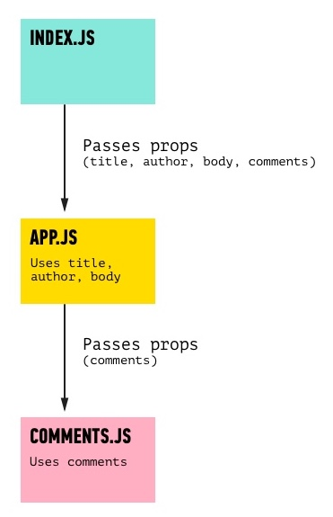

##  {.separator}

<h1>Nested Components</h1>

---

## Learning Objectives:
*After this lesson, you will be able to:*

- Diagram nested components.
- Render components within another component.
- Pass props to a nested component.

---

## In Your Blog...

...a section of your `App.js` `render()` function currently looks like this:

```html
<h3>Comments:</h3>
<p>{this.props.comments[0]}</p>
```

Discussion: While you can certainly display more comments with `<p>{this.props.comments[1]}</p>`, `<p>{this.props.comments[2]}</p>`, etc., do you think this is the best way?

<aside class="notes">

**Teaching Tips**:

- Elicit answers before discussing the following talking points.

- Spend a minute and try to get a consensus that there is a clear pattern forming here and how repetitive patterns in JS provide some indication that the code can be refactored for reusability.

- It would be a pain to have to explicitly define every comment when rendering `<Post />`, especially if each comment had multiple properties.

- This problem is a telltale sign that our separation of concerns is being stretched, and it's time to break things into a new component.

- To solve this problem, in the following slides we will **nest** `Comment` components within a `Post` component.

- We can create these comments the same way we created posts: By defining a `Comment` class that `extends Component` and has a `render()` method.

</aside>

---

## In Your Blog...


Next, we'll put comments inside an individual `Post` component. To do this, we can reference a comment using `<Comment />` inside of `Post`'s `render()` method.

* Starting from the blog post code, let's create a new file for a `Comment` component, `src/Comment.js`:

```jsx
import React, {Component} from 'react';

class Comment extends Component {
  render () {
    return (
      <div>
        <p>{this.props.body}</p>
      </div>
    )
  }
}

export default Comment
```

Discussion: What have we done?

<aside class="notes">

**Teaching Tips**:

- Elicit answers before discussing the following talking points.

**Talking Points**:

* We've defined our component class, which inherits from `React.Component`.
* We're exporting this `Comment` class by default for anything importing this file.
* We are returning JSX that contains a paragraph displaying a `body` prop (which will be passed in).

</aside>

---

## In Your Blog...

Now, in `src/App.js`, we need to import our `Comment` component so it's available to the `Post` component class.
* Change the top of `App.js` to include the new class:

```js
import React, { Component } from 'react';
import './App.css';

// Load in Comment component.
import Comment from './Comment.js';
```

---

## In Your Blog...

`<p>{this.props.comments[0]}</p>`

<aside class="notes">

**Talking Points**:

- With this setup, we can render one or more comments inside the `Post` component.
- Currently,
`<p>{this.props.comments[0]}</p>` is rendering one comment in the `Post` component from `App.js`.
- Now, instead of this line, we'll want to render a `Comment` component (which renders a paragraph with the comments, so it will look the same!).
- Edit that line to render a comment instead of directly rendering a paragraph.  

</aside>

---

## In Your Blog...

```js
<Comment body={this.props.comments[0]} />
```
<aside class="notes">

**Talking Points**:
- Make sure you send through the `body` prop that the `Comment` component class needs.

</aside>

---

## What Just Happened?!

<aside class="notes">

**Teaching Tips**: See if students can explain it before you move to the talking points.

**Talking Points**:
- Let's reflect on what just happened. We rendered a component _inside another component_.
- Technically, we just **nested** components. Very much like how we imported `Post` from `App.js` into `index.js` and rendered a post inside `index.js`, we've imported `Comment` from `Comment.js` into `App.js` and rendered a comment.
- Inside `App.js`, we're using some of the props to render a post and simply passing the `comments` prop on to be rendered with the `Comment` component class. So, the flow of the props looks like... (advance to next slide)
</aside>

---

## Nested Components



<aside class="notes">

**Teaching Tips**:

Check to see that everyone is following along. Remember to ask: "What questions do you have?" instead of: "Do you have any questions?"

**Talking Points**:

- That's nested components!
- What we're about to look into is just the idea of calling an object during the `render` `return` method — and that object can contain component calls.

</aside>

---

## Recap

**What We Did**

`<Comment body={this.props.comments[0]} />` passed just the first object in the `comments` array.

**What Else Can We Do?**


<aside class="notes">

**Talking Points**:
- We can also simply pass a variable as a parameter. For example, we could pass the whole `comments` array with `<Comment body={comments} />`.
- We can also just write a JavaScript expression if we put it inside curly braces. For example, if I had an object inside my `App.js`, each row of the object could individually call the `Comment` component.

</aside>

---

## Code-Along

```js
class Post extends Component {
  render() {
    let allComments = [
      <Comment body={this.props.comments[0]} />,
      <Comment body={this.props.comments[1]} />,
      <Comment body={this.props.comments[2]} />
    ]
    /// Rest of content...
  }
}
```

<aside class="notes">

**Talking Points**:
- This is meant to demonstrate a shorthand way of writing what your code already does.
- Why is this variable declared in the `render()` method? Because this calls the `Comment` component, which will render UI within it. The `render()` method is where all UI goes!

- Because the `render()` method is where our component will render all UI elements, it makes sense to initially place it here.

</aside>

---

## Code-Along


We could then call this object inside our `return` JSX with `{allComments}`, which would then call all three of those <`Comment />` statements:

```html
<div>
  <h1>{this.props.title}</h1>
  <p>by {this.props.author}</p>
  <div>
    <p>{this.props.body}</p>
  </div>
  <h3>Comments:</h3>
  {allComments}
</div>
```
<aside class="notes">

 **Talking Point**:

- Earlier, we briefly discussed that repetitive patterns in JS provide an opportunity for refactoring code for efficiency. A clear pattern that is emerging is the need to create three `Comment` components, each containing the same structure but differing in content. The idea of manually creating these elements also doesn't take into consideration that, in the future, there might be hundreds of comments to create. Does anyone have any suggestions for how we could improve the code and refactor for more efficiency?  

</aside>

---

## Code-Along

```js
class Post extends Component {
  render() {
    let allComments = this.props.comments.map( (comment, index) =>
        <Comment body={comment} key={index}/>
     )
    /// rest of content .....
  }
}
```

<aside class="notes">

**Teaching Tip**:

- Because the students will be proficient in JS, assume that one of their recommendations will be to implement a loop. Because `this.props.comments` is an array, it makes sense that `.map()` would be the best option here.


**Talking Points**:

- So, let's take a minute to refactor our code to incorporate a `.map()`.

- Because React is responsible for managing our elements, it also needs a way to uniquely identify repeating elements such as the `Comment` components. React does so using a **key** property, which in this case is the item's index position in the array, as this will guarantee that it is unique.

- Note: We could have put all of our code in one file, but it's a good practice to break components out into different files to help practice separation of concerns. The only downside is that we have to be extra conscious of remembering to **export/import** each component to the file where it's rendered.

 </aside>
