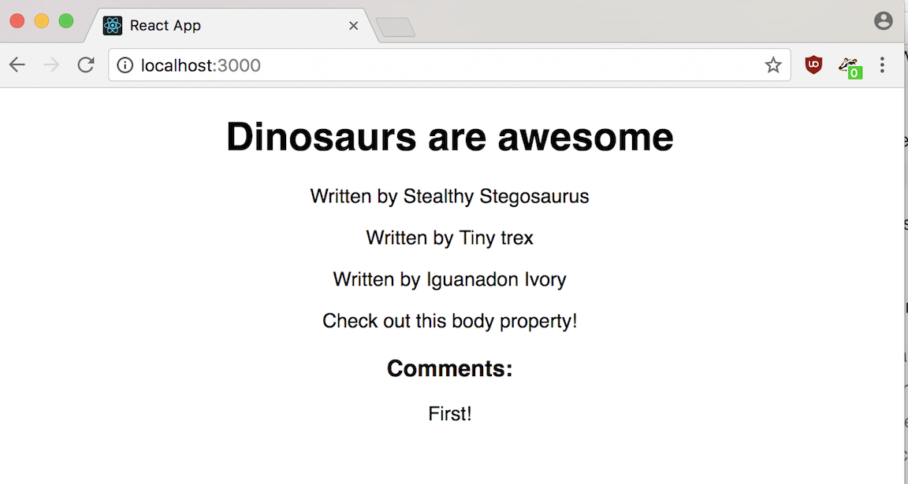

##  {.separator}

<h1>Blog Project:  
Add a Nested Component to Your Blog</h1>

---

## Steps:

* From the `index.js`, modify the `render()` method to pass the `Post` component a prop called `allAuthors`, which will be the `authors` array.

* Create an `Author` component that renders "Written by ", followed by an author.

* Amend your `Post` component's `render()` method first and create a variable, `authors`, which is equal to the `return` value of generating multiple `<Author />` elements.

> Hint: This variable will contain three calls to the `Author` component. Take into account that the number of authors might change per book, but that `this.props.allAuthors` will always be an array, even if it contains only one author.

* Make sure to pass in the `allAuthors` body as an argument to each `Author` component.

* Render the `authors` somewhere inside the UI for a `Post`.

<aside class="notes">

**Talking Points**:

This blog looks great so far! Now, our stegosaurus is actually collaborating more on the blog, so each post has multiple authors. Let's set that up. Besides Stealthy Stegosaurus, we have authors named Tiny T-Rex and Ivory Iguanodon.

> Hint: Remember that, whenever you write JavaScript expressions inside of JSX, you need to surround them with single curly braces (`{}`).

</aside>

---

## Advanced Challenge

<strong>Advanced challenge:</strong> If you like, you can use JavaScript's array `map()` method in `Post`'s `render()` method to avoid having to hard-code all of your `Author`s.

<aside class="notes">

**Talking Points**:

> Hint: If you're using `map()`, you should only have to return one `<MyPost />` inside of `map()`.</i>

**Teaching Tips**:

Students can read more about it [here](https://developer.mozilla.org/en-US/docs/Web/JavaScript/Reference/Global_Objects/Array/map) and [here](http://cryto.net/~joepie91/blog/2015/05/04/functional-programming-in-javascript-map-filter-reduce/).

</aside>

---

## Solution

Your solution should look as follows:

