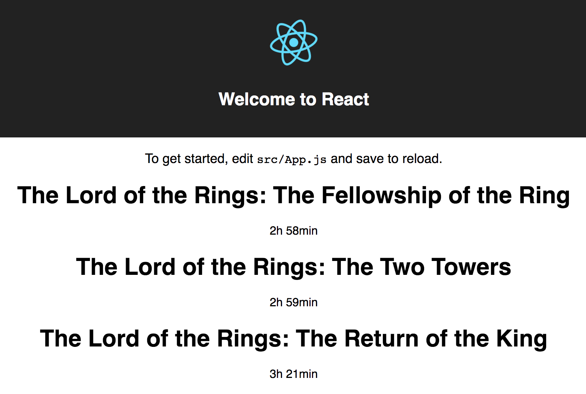

#   Code-Along: Lord of the Rings



<aside class="notes">

**Teaching Tips**:
- These first two slides (ending with the Gollum image) are for you to project to the class as you introduce the topic. The remainder of this lesson is an instructor-facing script. 

- The image here is so the class can see the end product and have an idea of what they are building.

**Talking Points**:

- Let's build something small to reinforce what you've learned so far. We're going
to practice creating components and passing information into them.

- We'll build a simple website that shows title and runtime information about the
original Lord of the Rings trilogy.

- Specifically, at the end of this lesson, your solution will look like what you see here. 

</aside>


---


<aside class="notes">

**Teaching Tips**:

- At this point you can stop projecting these slides and begin to project the code. The remainder of this lesson is a script for instructors (not student-facing slides).

---
## Code-a-long Script for Instructors

### Set Up

Open your terminal and use `create-react-app` to spin up another React
app. Call the application `lord-of-the-rings`:

```
create-react-app lord-of-the-rings
```

> Refer to the initial set up for a reminder of how to do this; make sure you stop the currently running application first!

Start the app and make sure it appears in the browser with the spinning React
logo:

```
npm start
```


**Teaching Tip**

- Make sure eveyone gives a 👍 in Slack when they are able to start the server.

---

### Create a Simple Movie Component
Open up your `./src` directory in your favorite text editor.

Inside of the `./src` folder, create a new React component file called `Movie.js`. Syntax is important here and conveys that the file is a React component, so make sure it begins with a capital letter (in this case, **'M'**). 


**src/Movie.js**

```js
import React, { Component } from 'react';

class Movie extends Component {
  render() {
    return (
      // We'll add JSX here.
    )
  }
}

export default Movie
```

Let's add some JSX to the `render()` function so this component will be visible in
our application. Let's keep the JSX simple for now, and we'll make it more
complex once we're sure it works.

Remember, our goal is to display the movie title and
runtime information.

Let's add one `<h1>` for the movie title and a `<p>` for the runtime. Remember,
the JSX of each component in React must ultimately descend from just one parent
element. Wrap the `<h1>` and `<p>` in a `<div>`.

The JSX will look like this:

```html
<div>
  <h1>The Lord of the Rings: A Trilogy</h1>
  <p>4h 37min</p>
</div>
```


Add this JSX to the component so that it's returned from the `render()` method.

**src/Movie.js**

```js
import React, { Component } from 'react';

class Movie extends Component {
  render() {
    return (
      <div>
        <h1>The Lord of the Rings: A Trilogy</h1>
        <p>4h 37min</p>
      </div>
    )
  }
}

export default Movie
```

### Viewing the Component

Let's make this component appear on the page. One great thing about using
`create-react-app` is that it tells us exactly what we need to do to start editing
our application. The home page says, "To get started, edit `src/App.js` and save to
reload." Let's do that!


Open `src/App.js`.

Add our `<Movie></Movie>` component just after the paragraph. Go back to the
app and see if it appears.

<aside class="notes">

### Dealing With Errors

```
Failed to compile
./src/App.js
  Line 16:  'Movie' is not defined  react/jsx-no-undef
```

Uh oh, there's an error!


**Teaching Tip**:

- Use this as an opportunity to ask the class what is going on, if they have seen that error before, and how to resolve it. Point out that the same error would appear in normal JS if you tried calling a function or variable that wasn't defined.


One does not simply refer to components in React. In our `src/App.js`, we're saying: "Display what's returned from the `Movie` component." However, we haven't told `src/Apps.js` where to find the `Movie` component! We must import a component before using it.

Add this `import` statement to the other imports at the top of
the `src/App.js` file:

```
import Movie from './Movie.js';
```
Now you should see the page without the error message, and it should have the
JSX from the `Movie` component.

The entire `App.js` should look like this:

**src/App.js**

```js
import React, { Component } from 'react';
import logo from './logo.svg';
import './App.css';
import Movie from './Movie.js';

class App extends Component {
  render() {
    return (
      <div className="App">
        <div className="App-header">
          
          <h2>Welcome to React</h2>
        </div>
        <p className="App-intro">
          To get started, edit <code>src/App.js</code> and save to reload.
        </p>
        <Movie></Movie>
      </div>
    )
  }
}

export default App
```


### Passing Information via Properties

We need our `Movie` component to be more flexible and to pass it data so we can use it to
display different titles and runtimes. In the `src/App.js` file, add `title`, `hours`, and `minutes` props to the `<Movie>` tag. These values will be passed to the component, where we can elicit their value.  

You can name these properties anything you want, but it's a good practice to be descriptive. 


```js
<Movie title="The Fellowship of the Ring" hours="2" minutes="58"></Movie>
```


React gathers all of the props we added to the `<Movie>` component and makes them each available through the `this.props` object. This means that, inside the `Movie` component, we can now access the values of props through `this.props.title`, `this.props.hours`, and `this.props.minutes`. 

In JSX, we use curly braces `{ }` to enumerate the value of something.


- In `src/Movie.js`, change the `<h1>` to display the value of
the `title` prop by writing `{this.props.title}`.

There was also the `hours` and `minutes` props. Update the JSX to access and display the value of each prop we created.

The `render()` function ends up looking like this:


**src/Movie.js**

```js
import React, { Component } from 'react';

class Movie extends Component {
  render() {
    return (
      <div>
        <h1>The Lord of the Rings: {this.props.title}</h1>
        <p>{this.props.hours}h {this.props.minutes}min</p>
      </div>
    )
  }
}

export default Movie
```

Refresh the page and make sure everything works correctly.


### Reusing the Component

Once you have props working for one component, you only need to write two more!

In `src/App.js`, call the `<Movie>` component again with different values for the `title`, `hours`, and `minutes` properties. Display information for the complete trilogy. 


```html
<Movie title="The Fellowship of the Ring" hours="2" minutes="58"></Movie>
<Movie title="The Two Towers" hours="2" minutes="59"></Movie>
<Movie title="The Return of the King" hours="3" minutes="21"></Movie>
```

**Teaching Tip**

- Point out that, in the previous blog post examples/code-alongs, an array was used to store the names of authors. We then used `.map()` to loop over the array and create an `Author` component, thereby creating more efficient code while keeping in mind that the number of authors may change over time. That being said, pose to the class: "Which basic data type could we use to store multiple key-value pairs that could also be stored in an array and looped over?"  


### Refactor `index.js`
So, we agree that an object should be created for each movie that would contain its movie-specific content and that those objects should be stored in an array, thereby allowing us to loop over the array and create only as many `<Movie>` components as there are objects.  

Open the `src/index.js` file and add the following just above `ReactDOM.render()`:


```js

let movies = [
  {
    title: "The Fellowship of the Ring",
    hours: 2,
    minutes: 58
  },
  {
    title: "The Two Towers",
    hours: 2,
    minutes: 59
  },
  {
    title: "The Return of the King",
    hours: 3,
    minutes: 21
  }
]

ReactDOM.render(
  <App/>,
  document.getElementById('root')
);
```

With our object in place, we can pass this to `App.js` as follows:

```js
ReactDOM.render(
  <App movies={movies}/>,
  document.getElementById('root')
);
```

### Refactor `App.js`

Let's go back to `arc/App.js`, refactor to loop over `this.props.movies`, and create the movies using the same `<Movie>` component code.

```js
  render() {
    let allMovies = this.props.movies.map( (movie, index) => 
        <Movie 
        	title={movie.title} 
        	hours={movie.hours} 
        	minutes={movie.minutes} 
        	key={index}
        /> 
     )
    /// Rest of content...
  }
}
);
```

With `allMovies` now containing an array of JSX elements, we can simply replace all the `<Movie>` components with `{allMovies}`.

```js
 render() {
   let allMovies = this.props.movies.map( (movie, index) => 
        <Movie 
        	title={movie.title} 
        	hours={movie.hours} 
        	minutes={movie.minutes} 
        	key={index}
        /> 
     )
     
    return (
      <div className="App">
        <div className="App-header">
          
          <h2>Welcome to React</h2>
        </div>
        <p className="App-intro">
          To get started, edit <code>src/App.js</code> and save to reload.
        </p>
        {allMovies}
      </div>
    )
  }
```

Once you have props working for one component, write two more!

In `src/App.js`, call the `<Movie>` component again with different values for the `title`, `hours`, and `minutes`
properties. Display information for the complete trilogy! (If you don't know everything about Lord of the Rings off the top of your head, here it is.)


# Solution


### Reflecting on Reusability

- Components are great because they allow us to compartmentalize code and easily
reuse parts we create. We simply set the value of props, and the component defines how everything should be displayed.

In this instance, we factored out some redundancy of the
movie titles.
- All of these movies start with `"Lord of the Rings:"`, so the only unique part is the prop.
- Similarly, we don't have to rewrite the format of the runtime information.

Building and reusing components becomes especially powerful as component complexity increases.
- Imagine building a component for video search results inside YouTube.
  - The props list is huge:
    - A ton of links.
    - Time information.
    - Preview images.
    - Options to add the result to a playlist.
    - And all sorts of other things.

Building multiple components may take more time but will allow you to separate concerns and reuse them more efficiently. Testing one small component is much easier than testing an all-encompassing one. 


### Internet Dive Point
In case you want to nerd out, here are handy links to the IMDb page for each Lord of the Rings
movie:

* [Lord of the Rings: The Fellowship of the Ring](http://www.imdb.com/title/tt0120737/)
* [Lord of the Rings: The Two Towers](http://www.imdb.com/title/tt0167261/)
* [Lord of the Rings: The Return of the King](http://www.imdb.com/title/tt0167260/)
