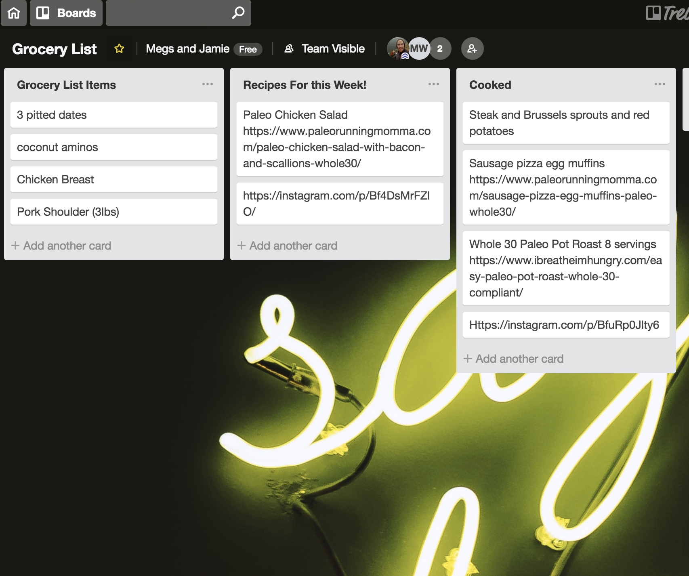
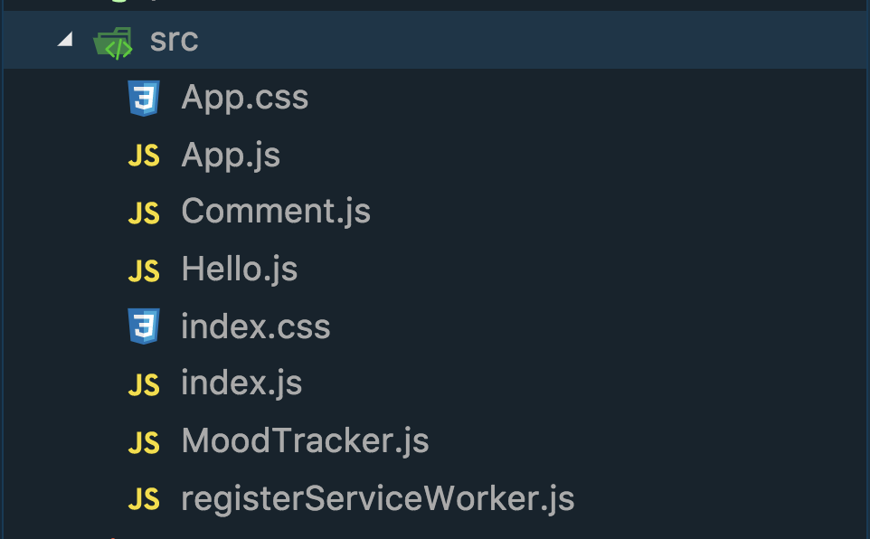
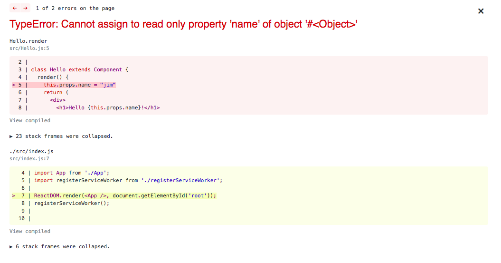

##  {.separator}

<h1>React State</h1>

---

## Learning Objectives

_By the end of this lesson, you will be able to:_

- Define what state means in relation to React components.
- Differentiate between `this.state` and `this.props`.
- Create an initial state in a component.
- Change the state of a component.


---

## Trello





<aside class="notes">

**Talking Points:**

- Imagine that you use [Trello](https://trello.com/), a popular project management app.

- This app is great for managing and keeping track of grocery lists, chores, personal projects, and more. As we see above, it can be used to add and remove information dynamically — all within the browser. How have we handled dynamic data so far in React? How could we manage to change this data?

</aside>

---

## Intro

- `hello_world` project status check.


<aside class="notes">

**Talking Points:**

- Before we get started, let's make sure our `hello_world` project is up and running.

- Be sure to switch which app is running locally!

- In React, we are able to handle data in one of two ways:

- Props **represent** data that is **immutable**, or read-only. Let's see what happens when you try to directly change `this.props.name` in the `Hello` component.

- But, what about when we need data that is dynamic and changes? That's where React's state comes in!

</aside>

---

## So Many Questions!

- What is state anyway?

- What's the difference between state and props?

- How do we access state?

<aside class="notes">

**Talking Points:**

- Values stored in a component's state are **mutable**, or changeable, attributes.

- State may appear similar to props, but there are quite a few important differences.

- Like props, which we access through the `this.props` object, we can access state using `this.state`.

- As state has the ability to be changed, it is not quite as straightforward as props. However, once you get the hang of it, you'll be able to build really interactive apps!

---

##




<aside class="notes">


**Talking Points:**

- Let's modify our earlier "Hello, World!" application to include a new `MoodTracker` component. Our `MoodTracker` will display a mood, and eventually a user will click a button to indicate on a scale of 1–10 how strongly they are feeling that mood.

- In order to get started with our new `MoodTracker` component, let's first create a new file called `src/MoodTracker.js`.

- `$ touch src/MoodTracker.js`

- Your directory structure should now look something like what's shown here.

</aside>

---

## MoodTracker

```jsx
// ...
import MoodTracker from "./MoodTracker";

class App extends Component {
  render() {
    // ...
    return (
      <div className="App">
        ...
        <MoodTracker />
      </div>
    );
  }
}

export default App;
```

<aside class="notes">

**Talking Point:**

- After creating the file, let's make sure to import our new component into `App.js` and put the component in our `render()` method.


**Teaching Tips:**

- In this intro, make sure to mention that the concept of state is not React-specific. Any values that are stored and manipulated on the front-end can be considered the state of the application.

- It's worth spending extra time reiterating that props are **immutable** and cannot be changed.

- Use the existing React repo to show what happens if you directly manipulate props. Make sure the students do not code along and instead are focused on seeing what happens on your machine. Your error message should looks something like this:



</aside>

---

## Initial State

`constructor`

<aside class="notes">

**Talking Point:**

- When working with values that are dynamic and changing, it's a good idea to provide an initial value for the changing pieces of data. Just like classes in other programming languages, a good way to make initial values is by creating a `constructor`. Constructors say, "When you create an instance of a class, do this." Without explicitly defining a constructor, our components will use the default constructor inherited from the `Component` class. That's why we didn't need a constructor before — we weren't doing anything differently than the normal default for every component.

</aside>

---

## Initial State


```js
import React, { Component } from 'react';

class MoodTracker extends Component {
  // What should happen when the component is first created?
  constructor() {
    // Make call to parent class' (Component) constructor.
    super();
    this.state = {
    // Your info here
    };
  }

  // What should the component render?
  render() {
  //  ....
  }
}

export default MoodTracker;
```

<aside class="notes">

**Talking Points:**

- The first thing we always put in a constructor is a call to `super()`, which says, "You should still do the default initialization for this class."

- Finally, we will add `this.state = {}`. This sets the initial values for our data, which are changeable.

</aside>

---

## React Components in React v16+


```js
import React, { Component } from 'react';

class MoodTracker extends Component {
  // What should the state be when the component is created?
  state = {
    // Your info here
  };

  // What should the component render?
  render() {
    //  ....
  }
}

export default MoodTracker;
```

<aside class="notes">

**Talking Points**:

- Even though you may see the `constructor` syntax used in some online resources, the best practices for how to write the initial state for components has changed in recent years. Instead, we can create a component and directly define the starting state without ever having to use a constructor as of React 16.

- Much cleaner, right? Throughout the course, we're going to use this newer way to define state, but you may run into the `constructor` syntax during your own research as this was the way it was done prior to the release of React version 16.

</aside>

---

## React Components in 2018

```js
class MoodTracker extends Component {
  // Define an initial state.
  state = {
    moodPoints: 1 // initialize this.state.moodPoints to be 1
  };

  // What should the component render?
  render() {
    //  ....
  }
}
```

<aside class="notes">

**Talking Points:**

- Now that we've built the skeleton for our component, let's define our state's initial values. We can do this by giving a value to the `state` object. Inside of that object, we can define any variables we'd like.

- We'll start our state with just one key-value pair. The key or label will be `moodPoints`, and the initial value for the `moodPoints` key will be `1`.

</aside>

---

## MoodTracker

```html
<p>You are this happy: {this.state.moodPoints}</p>
```


```js
return (
  <div>
    <p>On a scale of 1-10</p>
    <p>You are this happy: {this.state.moodPoints}</p>
  </div>
)
```

> Check it out! If you browse to `http://localhost:3000`, your state will be displayed.

<aside class="notes">

**Talking Points**:

- Next, let's make sure we display that information to the user. In your `MoodTracker.js` `render()` method, we'll let the user know how many mood points they have by adding in the line seen here.

- Note how similar this looks to using props. All React components include both `this.props` and `this.state`.

- All together, the code inside `render()` for our `MoodTracker.js` can now look as seen here.

```js
class MoodTracker extends Component {
  // Define an initial state.
  state = {
    moodPoints: 1 // initialize this.state.moodPoints to be 1
  };

  // What should the component render?
  render() {
    <div>
      <p>On a scale of 1-10</p>
      <p>You are this happy: {this.state.moodPoints}</p>
    </div>
  }
}
```

**Teaching Tips:**

- Don't spend much time on the `constructor` syntax. It may help those who are familiar with other OOP patterns, but it is not commonly used now.
- As you code along, make sure students `import` and `export` properly. Move the new component to a `components` directory if it will help with your organization.
- Now that you have a value in your `state` object, this can be a good opportunity to show how React Developer Tools can update state to help with debugging.

</aside>

---

## Changing State


<aside class="notes">

* Check for Understanding: Events in JavaScript


**Talking Points:**

- Now that we have an initial value up on the page, let's learn how to change this value and make it more dynamic.

- Step 1 in this process is to trigger an **event** — when the user interacts with the page in any way.

- Think back to using regular JavaScript or jQuery. What is the purpose of an event listener? Can you show me how to create a click event in JavaScript?

**Teaching Tips:**

- If students do not have much experience with events, make sure to talk through the `event` keyword. A good way to explore the `event` keyword is to examine the object when adding this event listener to the DOM.

```js
  document.body.addEventListener('keypress', (e) => console.log(e))
```

- After running that code, type a letter into the DOM and you should see the `event` object. Explore this with students so that they can see things like `e.target.value` and `e.key`.

</aside>

---

## Events in React

**Talking Points:**

- Event listeners in React look very similar to adding events through HTML attributes. There are two main differences when working with React's synthetic events:

- 1. React events are named using camelCase instead of lowercase:
   - `onClick` (React) vs. `onclick` (HTML)
   - `onSubmit` (React) vs. `onsubmit` (HTML)
- 2. In JSX, you pass the actual function in as the handler, rather than a string:
   - `<button onClick={this.doSomething}>Click Me</button>` (React)
   - `<button onclick="doSomething()">Click Me</button>` (HTML)

Additionally, there are _tons_ of events available to React elements.

<aside class="notes">

**Talking Points:**

- Event listeners in React look very similar to adding events through HTML attributes. There are two main differences when working with React's synthetic events:

- 1. React events are named using camelCase instead of lowercase:
   - `onClick` (React) vs. `onclick` (HTML)
   - `onSubmit` (React) vs. `onsubmit` (HTML)
- 2. In JSX, you pass the actual function in as the handler, rather than a string:
   - `<button onClick={this.doSomething}>Click Me</button>` (React)
   - `<button onclick="doSomething()">Click Me</button>` (HTML)

</aside>

---

## Turn and Talk: Synthetic Events

Check out the [React documentation](https://reactjs.org/docs/events.html#supported-events) on supported events.

With a partner, discuss the following:

1. What events could you see yourself using often?
2. What sort of events sound niche but interesting to play around with?

<aside class="notes">

**Teaching Tips:**

- Make sure to highlight the following commonly used events:
  - `onClick`
  - `onChange`
  - `onSubmit`
  - `onKeyPress`
  - `onMouseOver`

</aside>

---

## Code-Along, Continued: Setting State

We will create a button that the user can click, which will increase their mood by `1`.

> **Check for Understanding**: If we were just working with regular old JavaScript, what could we use to increase the value of a variable by `1`?

> How would we add or remove an item from an array?

> How about changing the value of a key-value pair in an object?


<aside class="notes">

**Teaching Tip:**

- If the class is advanced, this can be a good opportunity to introduce the [`spread`](https://developer.mozilla.org/en-US/docs/Web/JavaScript/Reference/Operators/Spread_syntax) operator.

</aside>

---

## IncreaseMood

```js
increaseMood = () => {
  this.setState({
    moodPoints: this.state.moodPoints + 1
  });
};
```

<aside class="notes">

**Talking Points:**

- Unfortunately, changing the value of `this.state` isn't quite as straightforward as something like `this.state.moodPoints++`.

- Instead, when we want to update a value in React, we will use a method called `this.setState()`. This method helps React update only certain parts of the DOM, resulting in a much faster website!

- First, we will create a method to increase the mood. Above the `render()` method, add the method seen here.

- ES6 update: We are going to be using arrow functions often in React. Check out [Mozilla Developer Network](https://developer.mozilla.org/en-US/docs/Web/JavaScript/Reference/Functions/Arrow_functions) for more info.

- Note that we call `this.setState` to change the state.

</aside>

---

## IncreaseMood

```js
render () {
  // Remember: This can only return one top-level element.

  return (
    <div>
      <p>You are this happy: {this.state.moodPoints}</p>
      <button onClick={this.increaseMood}>Cheer up!</button>
    </div>
  )
}
```


<aside class="notes">

**Talking Points:**

- Now, we'll create the button to trigger calling this function. The button will be displayed to the user, so we'll add it to the `render()` function. When the user clicks it, we'll call the `increaseMood()` function.

- Why did we write `onClick={this.increaseMood}` rather than `onClick={this.increaseMood()}`?

- More details on [function calls versus function references](https://stackoverflow.com/questions/15886272/what-is-the-difference-between-a-function-call-and-function-reference).

</aside>

---

## MoodTracker

All together, your `App.js` file now looks like this:

```js
// Bring in React and Component from React.
import React, { Component } from "react";

// Define our MoodTracker component.
class MoodTracker extends Component {
  state = {
    moodPoints: 0 // Initialize this.state.moodPoints to be 0.
  };

  // Increase moodPoints by 1 in this.state.
  increaseMood = () => {
    this.setState({
      moodPoints: this.state.moodPoints + 1
    });
  };

  // What should the component render?
  render() {
    // Make sure to return some UI.

    return (
      <div>
        <p>On a scale of 1-10</p>
        <p>You are this happy: {this.state.moodPoints}</p>
        <button onClick={this.increaseMood}>Cheer up!</button>
      </div>
    );
  }
}

export default MoodTracker;
```

> Check it out! If you browse to `http://localhost:3000`, your button now changes the state whenever it is clicked.

---

## Using React, **We Only Change the Parts of the DOM That Need to Be Changed**


<aside class="notes">

**Talking Points:**

- Whenever we run `.setState`, our component calculates the difference, or "diff," between the current DOM and the virtual DOM node. Then, it figures out how to update the state of the DOM in as few manipulations as possible; it only replaces the current DOM with parts that have changed.

- This is super important! Using React, **we only change parts of the DOM that need to be changed**.

- This has implications for performance.

- We do not re-render the entire application like we have been doing so far.

- This is one of React's core advantages.

</aside>

---

## Challenge: Count to 10

After 10 clicks, the user should see the counter reset to `1`.

> If you're interested in reading more in depth about this, here is more on what [should & shouldn't go in state](https://facebook.github.io/react/docs/state-and-lifecycle.html). This link is also in the Further Reading page at the end of this lesson.

```js
increaseMood = () => {
  let newMoodPoints; // Create new variable.
  if (this.state.moodPoints >= 10) {
    // Check to see if current state is greater than or equal to 10.
    newMoodPoints = 0; // If true, set MoodPoints to 0.
  } else {
    newMoodPoints = this.state.moodPoints + 1; // If false, increase MoodPOints by 1.
  }
  this.setState({
    moodPoints: newMoodPoints // Set state using new variable.
  });
};
```

---

## Challenge: Count to 10

Or, using ternaries:

```js
increaseMood = () => {
  let newMoodPoints = this.state.moodPoints >= 10 ? 0 : this.state.moodPoints + 1;
  this.setState({
    moodPoints: newMoodPoints
  });
};
```

</details>

---

## Additional Resources

- [React State vs. Props](http://lucybain.com/blog/2016/react-state-vs-pros/)

- [Understanding State in React](https://thinkster.io/tutorials/understanding-react-state)

- [Understanding `this.setState`](https://medium.com/@baphemot/understanding-reactjs-setstate-a4640451865b)

- [Understanding `setState`](https://css-tricks.com/understanding-react-setstate/)

- [React State FAQs](https://reactjs.org/docs/faq-state.html)
