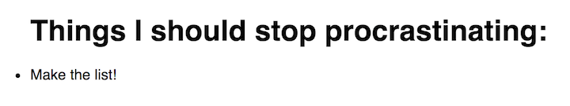

##  {.separator}
<h1>Exercise: To-Do List, Part 1</h1>

---

## Review

Ready to create an app?

<aside class="notes">

**Talking Point:**

- So, we've gone through all of the basics of React. To really hammer it home with practice, let's walk through creating an app. This will be a to-do list that keeps track of everything we need to accomplish for the day (after we finish this!). It's a lot, so we're going to want it to be editable.

</aside>

---

## To-Do List


<aside class="notes">

**Talking Point:**

- This is what our list will look like when we're finished.

</aside>

---

## Let's get started!


```sh
$ create-react-app todo-list
```

<aside class="notes">

**Talking Points:**

- Because this is a new exercise, be sure to close any running applications in your terminal first.

- Change directories to the main directory in which you're storing your projects. Inside, run your command as it is shown here.

</aside>

---

## Starting the App

The tool created a new directory for our app, so let's move into it.

```sh
$ cd todo-list
```

Use `npm start` to start a server that will serve your new React application.

```sh
$ npm start
```

* Check for your fresh React app [here](http://localhost:3000).


<aside class="notes">

**Teaching Tips:**

- A good way to make sure no one is left behind in this step is to give the students several minutes to build it themselves and give a 👍 in Slack when they are able to start the dev server.

* Check it out! If you browse to `http://localhost:3000`, you should have a fresh React app.

* Make sure that, as you go, you frequently check the site to ensure your changes are all reflected accurately.

</aside>

---

## 1. Build the Basic List


```js
import React, { Component } from 'react';
import './App.css';

class MyList extends Component {
  render() {
    return (
      <div>
        <h1> Things I should stop procrastinating:</h1>
        <ul>
          <li></li>
        </ul>
      </div>
    )
  }
}

export default MyList;
```


<aside class="notes">

**Talking Points:**

- Let's change the name of the component in `App.js` to something more meaningful, like `MyList`. Also change the name of the file from `App.js` to `MyList.js`, as best practices include keeping the file name the same as the component it contains as often as possible.

- Then, we'll change the contents of the JSX to have a header and the start of a list.

- This looks like it does here.

- Remember to change the name of the component where it's rendered in `index.js`! You'll also have to change the `import` statement in `index.js`, as you changed the name of the file containing the component from which `index.js` is importing!

</aside>

---

## Next...

```js
// In index.js
import React from 'react';
import ReactDOM from 'react-dom';
import MyList from './MyList';
import './index.css';

const toDos = ["Buy ice cream.", "Eat ice cream.", "Go to the gym."];

ReactDOM.render(
  <MyList theList={toDos} />,
  document.getElementById('root')
)

```

<aside class="notes">

**Talking Points:**

- `index.js` now looks as it is shown here.

- Now, our webpage displays an empty list.

</aside>

---

## Keeping Components Small




<aside class="notes">

**Talking Points:**

- We've learned that we should make new files for each component and that different functionalities should be split into different components.

- Now, let's make a component for `ListItem`. This component can simply render `<li>Make the list!</li>` so that we are starting with something in this list.

- Remember to use an `export` statement at the end of the new file to make the code in this file available elsewhere in our application.

- Don't forget to import your `ListItem` component into `MyList.js`. Then, include the component in what `MyList` renders with `<ListItem />` under the existing header (in place of the existing list item)!

At this point, our app looks as it is shown below.

</aside>

---

## Adding Style

Let's make it look better!

<aside class="notes">

**Talking Point:**

- Because we'll be looking at this for a while, let's spruce it up. Feel free to change the `index.css` file to include anything you'd like. On mine, I've centered the text and given it a light green background. An example is [here](images/index.css).

**Teaching Tip:**

- Make sure to explain that, in order to link a CSS file, you import it just like a JavaScript file.


</aside>

---

## 2. Add Props.

<aside class="notes">

**Talking Points:**

- This is a great start — we've already nested components (`ListItem` inside of `MyList`). Now, let's add some props to make this useful and check off that current list item!

- Let's first pass a prop into `ListItem` from `MyList`. We'll call the prop something simple, like `todoItem`. I'm pretty hungry; I'll pass in a value of "buy ice cream."

- Then, in `ListItem`, we'll add a list item that uses the `todoItem` prop instead of the existing hard-coded text.

- Our app now looks as it is shown here.

</aside>

Now, in `MyList.js`, we have:

```js
import React, { Component } from 'react';
import './App.css';
import ListItem from './ListItem';

class MyList extends Component {
  render() {
    return (
      <div>
        <h1>Things I should stop procrastinating:</h1>
        <ul>
          <ListItem todoItem="Buy ice cream." />
        </ul>
      </div>
    )
  }
}

export default MyList
```

---

## Second, props

... and in `ListItem.js`:

```js
import React, { Component } from 'react';
import './App.css';

class ListItem extends Component {
  render() {
    return (
      <div>
        <li>{this.props.todoItem}</li>
      </div>
    )
  }
}

export default ListItem
```

---

## App preview:


---

## 3. Render Different Items in an Array


```js
const newArray = originalArray.map( (itemInArray) => {
  // Do some stuff.
  // ...
  return transformedItem;
})
```

<aside class="notes">

**Talking Points:**

- If we want to make this a truly extensible list, we could create an array of items, pass them into props through the `ListItem` component, and then render each item. Let's do that now.

- Borrowing from an earlier bonus exercise, the easiest way to do this is by using the `.map()` function. A map is like a `for` loop. With `.map()`, you make a new variable and iterate through each item in an array. `.map()` will then return a new instance of the array. It looks as seen here.

</aside>

---

## Example

```js
const phrases = ['ice cream', 'dinosaurs', 'hobbits'];
const excitedPhrases = phrases.map( (phrase) => {
  return phrase + '!';
})
// excitedPhrases is ["ice cream!", "dinosaurs!", "hobbits!"]
```

<aside class="notes">

**Talking Point:**

- Here's a simple example that makes a new array by adding an `!` to each element of an existing array.

</aside>

---

## Plan

* In the `MyList` component, make an array of items for the list called `theList`.
* Create a variable called `todoItems` to refer to the new array output by the `.map()` method.
* Use `.map()` to iterate through the `todoItems` array one `item` (this could be any name you'd like) at a time, and use each one to create a `ListItem` component in the `todoItems` list.
* We can refer to this list later by simply calling the variable in JSX (like any other variable). For example, we could say `{todoItems}`.

---

## Implementing the Plan - Part I


```js
const todoItems = this.props.theList.map( (item, index) => (
  <ListItem todoItem={item} key={index} />
))
```

<aside class="notes">

**Talking Point:**

Here is the `.map()` function call that will do this for us, which we'll put in the `MyList` component.

Note that `.map()` also has can pass a second argument we can use, which is the index of the item in the array.

`key={index}` describe the importance of the key tag and how React uses it to make pages load faster.

</aside>

---

## Implementing the Plan - Part II

```jsx
class MyList extends Component {

  render() {

    const todoItems = this.props.theList.map( (item, index) => (
      <ListItem todoItem={item} key={index} />
    ))

    return (
      <div>
        <h1>Things I should stop procrastinating:</h1>
        <ul>
          {todoItems}
        </ul>
      </div>
    )
  }
}
```

<aside class="notes">

**Talking Points:**

- Let's also create that array! In `index.js`, create an array variable called `toDos`. Fill it with what you need to do for the day.

- My final `MyList` component class looks as it is shown here.

</aside>

---

## Implementing the Plan - Part III


Here is the `index.js` file:

```js
import React from 'react';
import ReactDOM from 'react-dom';
import MyList from './MyList';
import './index.css';

const toDos = ["Buy ice cream.", "Eat ice cream.", "Go to the gym."];

ReactDOM.render(
  <MyList theList={toDos} />,
  document.getElementById('root')
)

```

---

## Implementing the Plan - Part IV

And the `ListItem.js`, which hasn't changed:
```js
import React, { Component } from 'react';
import './App.css';

class ListItem extends Component {
  render() {
    return (
      <div>
        <li>{this.props.todoItem}</li>
      </div>
    )
  }
}

export default ListItem;

```

---

## Implementing the Plan - Part IV


<aside class="notes">

**Talking Points**:

- This is what we have now.

</aside>
