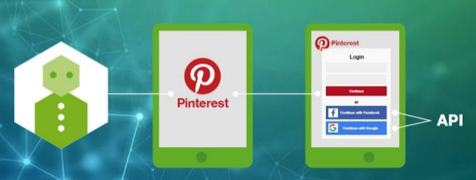
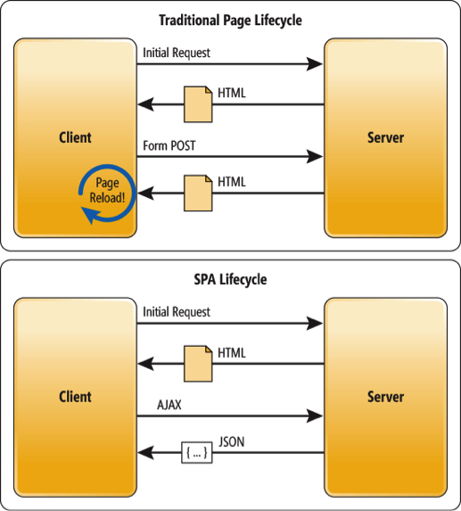
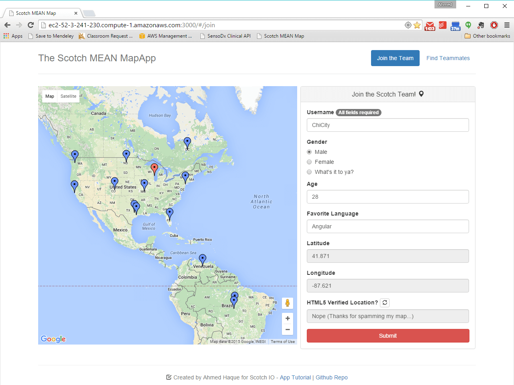
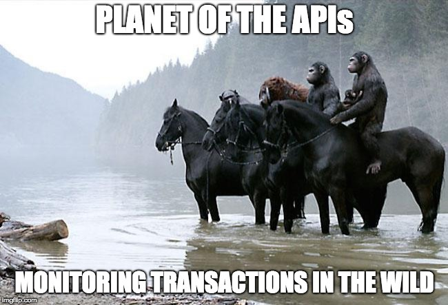

##  {.separator}
<h1>Introduction to APIs</h1>

---

## Learning Objectives

After this lesson, you'll be able to:

- Describe what an API is and why we might use one.
- Identify common APIs on the web.

---

## What Does API Stand For?

API stands for "application programming interface."

<aside class="notes">

**Talking Points**:

- "API" is a broad term. It's short for "application programming interface" and can be used to define everything from URL endpoints to DOM methods like `document.getElementById` and even the underlying methods and plugins that help your computer run.

- Throughout your development career, you'll see tons of references to APIs. Today, we'll learn about connecting to RESTful APIs through HTTP requests.

- Basically, an API is a service that provides raw data for public use. As third-party software developers, we can access an organization's API and use its data within our own applications.

</aside>

---

## Why Use APIs?

 

 Image Credit: [Anuschka Diderich-Rijnsburger](https://www.slideshare.net/AnuschkaDiderichRijn?utm_campaign=profiletracking&utm_medium=sssite&utm_source=ssslideview) on SlideShare 

<aside class="notes">

**Teaching Tip**:

- This class doesn't cover any back-end web development, but this would be a good opportunity to give an example of how you've interacted with a custom-made API in the past.

**Talking Points**:

- APIs can make development faster. Why recreate data when we don't have to? Think about past projects or ideas that would have been easier if you could have pulled in data already gathered elsewhere.

- APIs can provide us with data that we wouldn't otherwise be able to create ourselves.

- As we move into building single-page applications (SPAs), we'll be relying more on both third-party APIs and APIs that we can create using back-end programming languages.

</aside>

---

## Web APIs

 
 Image Credit: [Signity Solutions](http://www.signitysolutions.com/blog/miscellaneous-posts/what-is-an-apis-and-cms/) 

<aside class="notes">

**Talking Point**:

- When we think about web APIs, we're thinking about communicating with servers that can send and receive data. Let's look at an example.

</aside>

---

## How an API Fits in With SPAs

 
Image Credit: [Zanon.io](https://zanon.io/posts/angularjs-how-to-create-a-spa-crawlable-and-seo-friendly)

<aside class="notes">

**Talking Points**:

- In a traditional server-side-rendered application, the server retrieves data from the database and uses that information to format the HTML on the server side. <!-- (Demo https://www.amazon.com). -->

- With SPAs, the server retrieves data from the database and responds to requests with JSON. <!-- (Demo http://www.swapi.co/). -->

- We can use various web-based APIs to populate our SPAs with data asynchronously. This way, the user can interact with the application and see it respond with new data without needing to refresh the page or navigate to a new one. <!-- (demo [/starwars](/starwars)). -->

  
 Image Credit: [Build a MEAN App with Google Maps](http://www.signitysolutions.com/blog/miscellaneous-posts/what-is-an-apis-and-cms/) 

<aside class="notes">

**Talking Point**:

- Imagine you want to embed a Google Map in your web app. You aren't going to make that map yourself, so somehow you have to use Google Maps. Google Maps has an API you can call to get that map information. All you have to do is send a request to the Google Maps API and it sends back a map you can use.

**Teaching Tips**:

- If there is time, feel free to mention that SDKs for popular APIs exist for specific frameworks. [`google-maps-react`](https://github.com/fullstackreact/google-maps-react) is a popular example.
- Make sure to mention the caveat that, by using a third-party SDK, you're giving up control to a "black box." This means that if the Google Maps API changes and the SDK does not, you're in for trouble as a developer.

</aside>

---

## API Exploration

| What's the API? | A Sample URL You Can Call |
|------|------------|
| **[Giphy's API: Request a list of all funny cats.](https://github.com/Giphy/GiphyAPI)** | http://api.giphy.com/v1/gifs/search?q=funny+cat&api_key=dc6zaTOxFJmzC |
| **[The Star Wars API: Request R2-D2 info.](http://swapi.co/)** | http://swapi.co/api/people/3 |
| **[Markit Digital's API: Request current Apple stock info.](http://dev.markitondemand.com/Api/Quote/xml?symbol=AAPL)** | http://dev.markitondemand.com/Api/Quote/xml?symbol=AAPL

<aside class="notes">

**Talking Points**:

- A variety of APIs are available on the internet. To call an API, send a request to a URL and that API will return data to your program. You can pull data from any web app that offers an API.

- You can make this request as specific as you'd like. Each web app offers different options for its API; you just have to find out what you can request from it.

- These are just a few examples of APIs you can use. Check it out — the left column is the common name you might know. The right column is the URL you would send a request to in your program.

**Teaching Tips**:

- Does the JSON look unreadable in the browser? If you're using Google Chrome, install the [JSONView plugin](https://chrome.google.com/webstore/detail/jsonview/chklaanhfefbnpoihckbnefhakgolnmc?hl=en).

- Click the URLs in the table to show students what each call would return.

- Make sure to also get rid of the API key query parameter when requesting Giphy so you can show what a response looks like when a key isn't provided.

- Unless the class is already versed in making API calls, it's likely that they don't use JSONView. Make sure to check that students have this plugin installed.

- Alternatively, have students download [Postman](https://www.getpostman.com/) and provide a brief overview.

</aside>

---

## Building on the Shoulders of Giants

- [Google Translate API](https://cloud.google.com/translate/)
- [IBM Watson](https://developer.ibm.com/watson/)
- [Azure Cognitive Services](https://azure.microsoft.com/en-us/services/cognitive-services/)

<aside class="notes">

**Talking Points**:

- One of the advantages of APIs is easy access to revolutionary resources that can be used in your own personal projects.

- Here are a few examples of resources available to you once you begin to take advantage of APIs.

</aside>

---

## Turn and Talk: API Exploration

- [Public APIs](https://github.com/abhishekbanthia/Public-APIs)
- [A Curated List of APIs](https://medium.com/@benjamin_libor/a-curated-collection-of-over-150-apis-to-build-great-products-fdcfa0f361bc)

<aside class="notes">

**Talking Point**:

- Take some time to explore the public APIs that exist online. Search Google or use an API aggregator to find interesting examples. Post anything you find to Slack.

**Teaching Tip**:

- Send the URLs to students through Slack for quick access.

</aside>

---

## APIs in the Wild

Can you think of any websites you visit that pull information from other places (and probably use an API)?

<aside class="notes">

**Teaching Tip**:

Suggested examples:

- [IFTTT](https://ifttt.com/)
- [Hootsuite](https://hootsuite.com/)

</aside>

---
