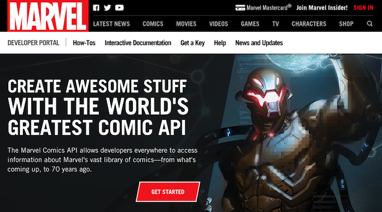

##  {.separator}
<h1>Transferring Data</h1>

---

## Learning Objectives

After this lesson, you'll be able to:

- Contrast JSON and XML.
- Describe API keys.

---

## Return Format

<br>
<sup>Image Credit: [All Things Clipart](http://www.allthingsclipart.com/09/waiting.clipart.htm)<sup>

<aside class="notes">

**Talking Points**:

- No user likes it when they're on a page that takes forever to load. If your web app has a Google Map, a list of movies from IMDb, and a Spotify catalog, that's a lot of data. You want that information returned as quickly as possible so users aren't waiting forever for your page to load.

- All of this information — from different browsers and servers — has to travel through the network. That's almost certainly the slowest part of the request cycle. We want to minimize that.

- When working with single-page applications, we'll only load the bare minimum of HTML and CSS to let the user know that the page is loading. Then, we'll make our API calls and flesh out the rest of the page as the data comes in.

</aside>

---

## How APIs Are Read

APIs can be read using two major data formats: **JSON** and **XML**.

<aside class="notes">

**Talking Points**:

- All data sent via HTTP are strings. But, what we want to pass between web applications is **structured data** (i.e., arrays and hashes). Thus, native data structures can be **serialized** into a string representation of the data. Serializing refers to taking a large string of data and turning it into something readable and useful.

- There are two major serialized data formats that you will typically encounter: JSON and XML.

</aside>

---

## JSON

```json
{
  "users": [
    {"name": "Wonder Woman", "id": 0},
    {"name": "Black Panther", "id": 1},
    {"name": "Batgirl", "id": 2}
  ]
}
```

<aside class="notes">

**Talking Points**:

- JSON stands for **J**ava**S**cript **O**bject **N**otation and has become a universal standard for serializing native data structures for transmission. It's lightweight, easy to read, and quick to parse. JSON looks like this — information is separated with braces and commas.

- Remember, JSON is a serialized format. While it may look like an object, it needs to be parsed so we can interact with it as a true JavaScript object.

</aside>

---

## XML

```html
<users>
  <user id="0">
    <name>Wonder Woman</name>
  </user>
  <user id="1">
    <name>Black Panther</name>
  </user>
  <user id="2">
    <name>Batgirl</name>
  </user>
</users>
```

<aside class="notes">

**Talking points**:

- XML stands for E**x**tensible **M**arkup **L**anguage and is the forebearer of serialized data formats (itself based on HTML). XML is cumbersome to parse but remains a major format because of its legacy usage across the web.

- XML also has opening and closing tags — just like HTML.

</aside>

---

## JSON or XML?

`https:///api/index.php?output=json` or
`https:///api/index.php?output=xml`

<aside class="notes">

**Talking Point**:

- You've probably guessed that most developers favor using a JSON API, if available. Conveniently, many APIs publish data in multiple formats and let you specify which you'd like to use. See the examples here.

</aside>

---

##




- [Marvel Comics API](http://developer.marvel.com/documentation/getting_started)

- [ProgrammableWeb API Directory](http://www.programmableweb.com/apis/directory)

- [XML-to-JSON Conversion Tool](https://www.npmjs.com/package/xml2json)

<aside class="notes">

**Talking Points**:

- Chances are good that most major content sources you follow online publish their data in some type of serialized format. Even Marvel Comics [publishes an API](http://developer.marvel.com/documentation/getting_started). Look around for a "Developers" section on major websites; or, if you'd like a cheat sheet, you can try the [ProgrammableWeb API Directory](http://www.programmableweb.com/apis/directory).

- Generally, try to always use JSON APIs if they're available. If they're not, you can use tools to help convert XML, such as [xml2json](https://www.npmjs.com/package/xml2json).

</aside>

---

## Authentication

            

<aside class="notes">

**Talking Points**:

- While a majority of APIs are free to use, many of them require an API "key" that identifies the developer requesting data access.

- Some APIs, such as Spotify's music catalog, might seem like they should be available for anyone to access, but they're not.

- Let's say PayPal had an API from which shops like Etsy could request your money. When you buy something and Etsy calls PayPal, you'd want Etsy to prove it was actually Etsy, right? You don't want anyone to pretend to be Etsy, go to PayPal, and charge you $500. Instead, you'd want Etsy to somehow authenticate itself to PayPal. This is accomplished by giving Etsy a private key to use at PayPal that only Etsy knows. Every time Etsy makes a request to PayPal, it can say, "Hey, I'm requesting this. Here is my proof that I'm allowed to do so."

</aside>

---

## Getting an API Key


Giphy API: https://api.giphy.com/

* No key: http://api.giphy.com/v1/gifs/search?q=funny+cat

* Now, try it with a key: http://api.giphy.com/v1/gifs/search?q=funny+cat&api_key=dc6zaTOxFJmzC


<aside class="notes">

**Talking Points**:

- Many APIs require a key to regulate usage and prevent abuse. Some APIs also rate-limit developers, which means they have a cap on the free data allowed during a given time period.

- Try hitting the Giphy API with no key. You can just click on the link to show you how it's done. You get an error message in JSON formatting: `{"message": "No API key found in request"}`.

- Now try with a key. You get a list of funny cats — still in JSON formatting. It would be more readable if we added new lines between cat GIFs in the list, but that's not automatic.

**Teaching Tips**:

- If possible, walk through the steps required to generate an API key with Giphy. It's pretty easy to get a key, but it requires creating an account.

- Make sure to emphasize that all APIs that use keys have their own ways of generating them. Some are easy to get, like Giphy. Others are difficult, and you may even have to email the developers of the app themselves.

</aside>

---

## Important Note

**Store those keys somewhere private.**

<aside class="notes">

**Talking Points**:

- When you're calling APIs that require a key, it's up to you to store those keys somewhere private. They're the only proof you have that you are you and that you're allowed to call the API.

- For example, it's important to not push your API keys to a public GitHub repo. This is especially true when working with [Amazon Web Services (AWS)](https://aws.amazon.com/). Here's an example of a [stolen key horror story](https://wptavern.com/ryan-hellyers-aws-nightmare-leaked-access-keys-result-in-a-6000-bill-overnight).

</aside>
