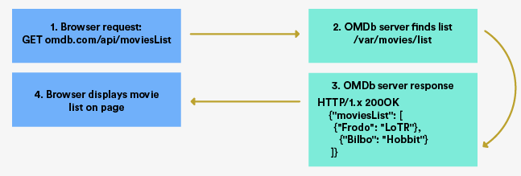

##  {.separator}
<h1>fetch </h1>

---

## Learning Objectives

After this lesson, you'll be able to:

- Identify the pieces of a `fetch()` call.
- Create a React component that calls an API.

---

## Introducing `fetch()`

`fetch()` + AJAX requests = The power to build single-page applications that do not require refreshes.


<aside class="notes">

**Talking Points**:

- So, we know what an API is. How can we use it to dynamically manipulate the DOM with the given data?

- There are many ways in which we can retrieve this data. Tons of libraries have been created over the years to make this easier than JavaScript's built-in `XMLHttpRequest` methods. You may see APIs being used with libraries such as jQuery, axios, request-promise, and bluebird.

- However, a couple of years ago, JavaScript debuted a new method called `fetch()`. This is an easy way to request data that is now completely built into the language.

- The requests we're making are called **AJAX** requests. As you'll come to learn, `fetch()` combined with AJAX requests allows us to build single-page applications that do not require refreshes.

</aside>

---

## AJAX

| Type of Request | What It Does |
|-----------------|---------------|
| `GET`  | Read ("Give me movie names from your database.")|
| `POST` | Create ("Here's a new movie for your database.")|
| `PATCH` | Update ("Hey, this movie has a new title.")|
| `PUT` | Update ("Hey, this movie has changed.")|
| `DELETE` | Delete ("That movie is so bad you should just take it out of the database.")|


<aside class="notes">

**Talking Point**:

- AJAX, which stands for **A**synchronous **Ja**vaScript and **X**ML, is the method through which we're able to make HTTP **requests**. The standard requests we'll be making are `GET`, `POST`, `PUT`, `PATCH`, and `DELETE`.

</aside>

---

##



<aside class="notes">

**Talking Points**:

- The browser packages your request together using `fetch()` and sends it off to a server. The server then listens to your request and provides a **response**. It looks like what's shown here.

- When you visit your favorite websites, your browser is making a request and the server is providing a response. `fetch()` allows us to perform the same type of requests over a network.

- Imagine fetching weather information and rendering it on your website. Or maybe you want to create a real-life Pokédex. You can use `fetch()` to build these applications.

</aside>

---

## `fetch()` in Action

```
  http://api.open-notify.org/astros.json
```


```json
{
  "number":5,
  "people":[
    {
      "craft":"ISS",
      "name":"Oleg Novitskiy"
    },
    {
      "craft":"ISS",
      "name":"Thomas Pesquet"
    },
    {
      "craft":"ISS",
      "name":"Peggy Whitson"
    },
    {
      "craft":"ISS",
      "name":"Fyodor Yurchikhin"
    },
    {
      "craft":"ISS",
      "name":"Jack Fischer"
    }
  ],
  "message":"success"
}
```

<aside class="notes">

**Talking Points**:

- Let's take a look at `fetch()` in action.

- Imagine we want to `fetch()` the number of astronauts currently aboard the International Space Station (ISS). Good thing there's an API for that, right? This API allows us get the information using the URL at the top of this slide.

- The API provides a response that looks like what's shown here. It tells us the number of people currently in space on the ISS and their names. It also gives us `"message": "success"` so we know it worked.

- If you'd like, you can copy and paste the API URL into a browser to see this happen.

</aside>

---

## We can fetch this JSON easily using JavaScript

How? The skeleton code looks like this:

```js
fetch(url)
  .then((response) => {
    return response.json();
  })
  .then((json) => {
    // Here, you get the JSON data to modify or display as you please.
  })
  .catch((ex) => {
    // If there is any error, you will catch it here.
  });
```

---

## We can fetch this JSON easily using Javascript

Or, in older JS syntax:

```js
fetch(url)
  .then(function (response) {
    return response.json();
  })
  .then(function (json) {
    // Here, you get the JSON data to modify or display as you please.
  })
  .catch(function(ex) {
    // If there is any error, you will catch it here.
  });
```

---

## We can fetch this JSON easily using Javascript

Let's look at how we would apply this for our astronauts:


```js
const issApi = 'http://api.open-notify.org/astros.json';
fetch(issApi)
  .then((response) => {
    return response.json();
  }).then((json) => {
    console.log('JSON from the ISS', json);
  }).catch((ex) => {
    console.log('An error occurred while parsing!', ex);
  });
```

---

##

Let's break down this API call into a few steps.

- `const issApi = 'http://api.open-notify.org/astros.json'`: First, we define our API URL from which to fetch.

- `fetch(issApi)`: We call `fetch()` on that API URL.  By default, fetch will use a `GET` request.

- `.then((response) => { return response.json()`: We take the response when the server provides it. We return `response.json()`.  Note that the server response is a `string` and we are converting it into a json data.

- `.then((json) => { console.log('JSON from the ISS', json)`: We take that `json` and `console.log` it.

- `catch((ex)`: If an error occurs, we catch it and log it.

<aside class="notes">

**Talking Points**:

- That's how simple `fetch()` is! While there are other ways to handle the response (such as `html` or `blob`), this approach makes writing requests to APIs and other network calls in JavaScript easy.

- It's important to note that, while `fetch()` is part of the JavaScript standard, some browsers, such as Internet Explorer, [don't support it](http://caniuse.com/#search=fetch). You may need a polyfill — code that implements a feature on web browsers that don't support it — for live projects. If you need a polyfill for a production project, [GitHub's](https://github.com/github/fetch) is a popular option.

</aside>

---

## Pop Quiz

<details>
  <summary><strong>Q: From which React life-cycle method should API calls be made?</strong></summary>
  <br />
  <p>
    API calls should be made from the <code>componentDidMount()</code> method. According to the <a href="https://facebook.github.io/react/docs/react-component.html#componentDidmount">React documentation</a>, if you need to load data from a remote endpoint, this is a good place to instantiate the network request.
  </p>
</details>

<details>
  <summary><strong>Q: What does it mean to make a <code>GET</code> request?</strong></summary>
  <br />
  <p>We're asking the server to send us data to read. To <code>GET</code> means to "read."</p>
</details>

<aside class="notes">

**Teaching Tip**:

- Have students send you the answers through Slack before revealing them.

</aside>

---

## Code-Along: Shakespeare


http://ShakeItSpeare.com/api/poem

<aside class="notes">

**Talking Point**:

- It's time for you to build a simple component that shows a randomly generated Shakespeare poem. We'll do this using the ShakeItSpeare API. (There really is an API for anything!)

</aside>

---

## Fetching Shakespeare in a React Component

```js
import React, {Component} from 'react';

class Home extends Component {
  componentDidMount() {
  	/* nothing here... yet! */
  }

  render() {
    return (
      <div>
        <h1>My favorite Shakespeare poem:</h1>
      </div>
    )
  }
}


export default Home;
```

<aside class="notes">

**Talking Points**:

- Let's go back to your blog project (make sure it's running).

- Let's use the `fetch()` API directly inside a React component to render a poem. We'll be using the `Home` component, so open `Home.js` to edit.

- The official [React documentation](https://facebook.github.io/react/docs/react-component.html#componentdidmount) tells developers that any network requests should be placed inside the `componentDidMount()` method.

- Start by changing the `Home` component to have an empty `componentDidMount()` method.

- Set the stage for returning a poem in the `div` by changing the text within the `<h1>` to the text "My favorite Shakespeare poem:" as shown here.

</aside>

---

## Making the API Call

- Fill in the `componentDidMount()` method with a call to the API.
- Save the poem in a state called `poem`.
- Render the poem.

<aside class="notes">

**Talking Points**:

- We can now tell our component to fetch a Shakespeare poem and set it to our state. We do this by adding the `fetch()` call inside of `componentDidMount()`.

- Calling `setState()` then triggers a re-`render()` inside of our component.

- So, we'll do the three steps here.

</aside>

---

## The Setup

```js
import React, {Component} from 'react';

class Home extends Component {
  state = {
    shakeSpeare: ""
  }

  componentDidMount() {
    // fetch a poem
    const poemApi = 'http://ShakeItSpeare.com/api/poem';
    fetch(poemApi)
      .then((response) => {
        return response.json();
      }).then((json) => {
          this.setState({ shakeSpeare: json.poem });
      }).catch((ex) => {
        console.log('An error occurred while parsing!', ex)
      });
  }

  render() {
    const poetry = this.state.shakeSpeare;
    return (
      <div>
        <h1>My favorite Shakespeare poem:</h1>
        {poetry}
      </div>
    )
  }
}
```

<aside class="notes">

**Talking Points**:

- You should have what's shown here.

- You can try it out at this point; it works (hopefully).

</aside>

---

## Render

```js

render() {
  let poetry = this.state.shakeSpeare;
  if (!this.state.shakeSpeare){
    poetry = 'Loading...';
  }

  return (
      <div>
        <h1>My favorite Shakespeare poem:</h1>
        {poetry}
      </div>
    )
  }
```


<aside class="notes">

**Talking Points**:

- Just in case, let's add a quick check.

- Add an `if` statement under `render()`.
  - This simply checks to see if `fetch()` has completed before `render()` tries to return the poem. Otherwise, it returns "Loading...".
  - For this especially, it's important that the state is declared in initial state object. This way, the `if` statement does not fail if the `fetch()` hasn't yet created the state.
  - Note the change const to let when declaring `poetry` variable as the string will change after the `fetch()` is completed.

- You're done! Your `Home` page should now load a random Shakespeare poem.
</aside>

---

## Hast Thou Not a Word of Joy?
— Romeo and Juliet, Act 3, Scene 5


