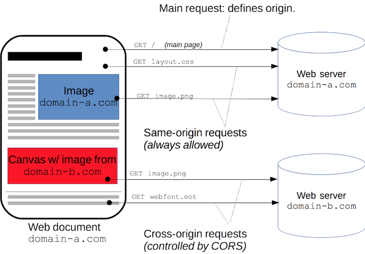

##  {.separator}
<h1>Heroku</h1>

---

## Learning Objectives

After this lesson, you'll be able to:

- Describe Heroku.
- Deploy an app on Heroku.
- Set up a CORS proxy on Heroku.

---

## Deploying a React App

<br>
<sup>Image source: http://cloudless.studio/articles/29-is-phoenix-deployment-really-that-hard</sup>

<aside class="notes">

**Talking Points**:

- You've been running everything on `localhost`, which is great for testing. But, what if you want to show off what you've done?

- Let's learn an easy way to deploy a React app. We can use something called **Heroku** to deploy a React application to the internet in less than five minutes. Heroku is incredibly popular among web developers and provides five free applications to every user.

**Teaching Tip**:

- **Strongly** suggest to students that they have a working knowledge of Git. Before moving ahead, have them read the [Git Basics guide](https://git-scm.com/book/en/v2/Getting-Started-Git-Basics) or [try Git](https://try.github.io/levels/1/challenges/1) if they have **no experience** with it.

</aside>

---

## What Is Heroku?


Create a free account at:

https://heroku.com

<aside class="notes">

**Talking Points**:

- Heroku is a cloud platform that allows developers to quickly deploy applications to the internet.

- These applications don't need to be React applications. Heroku supports Node.js, Ruby, Java, PHP, and many others. You can read about it [here](https://devcenter.heroku.com/).

- Before we dive in, create a free account at [heroku.com](https://heroku.com). Once you've signed up, confirm your account and sign back in. You'll be redirected to the Heroku dashboard at [https://dashboard.heroku.com/apps](https://dashboard.heroku.com/apps). You can view all of your applications on the dashboard once they're deployed.

</aside>

---

## The Heroku Command Line Interface

Download and install the Heroku command line interface (CLI):

https://devcenter.heroku.com/articles/heroku-cli


<aside class="notes">

**Talking Points**:

- Before we go any further, make sure you stop any currently running React apps.

- Let's download and install the [Heroku CLI](https://devcenter.heroku.com/articles/heroku-cli). You can download the installer from the link provided or run `brew install heroku` in your terminal application.

- This tool is designed to make your life easier as a developer by integrating Heroku application development and deployment directly into the command line.

- You may need to restart your terminal session before moving forward. Why? Because you've just installed software to modify your terminal's environment, and your environment variables may not have updated yet.

</aside>

---

## Log In To Heroku

```bash
Enter your Heroku credentials.
Email: adam@example.com
Password (typing will be hidden):
Authentication successful.
```

<aside class="notes">

**Talking Point**:

- Log in to Heroku using the command line. Do so by typing in `heroku login`. You'll be prompted to enter your Heroku credentials, followed by an authentication message like the one shown here.

</aside>

---

## Heroku App


```bash
create-react-app your_app_name_here
cd $your_app_name_here
```
<aside class="notes">

**Talking Point**:

- You can deploy an existing app with Heroku, but for the sake of completion, we'll do it from scratch. Use the `create-react-app` command in your terminal to create an app — name it whatever you'd like. Then, change directory into the app's directory.

</aside>

---

## Initialize a Git Repo

```
git init
```

<aside class="notes">

**Talking Point**:

- Now, we need to initialize a Git repository inside of our React application. The Heroku CLI requires Git to handle versioning for deployment.

</aside>

---

## Create a Heroku Application

create-react-app-buildpack


```sh
heroku create your_app_name_here --buildpack https://github.com/mars/create-react-app-buildpack.git
```

<aside class="notes">

**Talking Points**:

- Next, we'll create a Heroku application using something called the `create-react-app-buildpack`.

- A buildpack is a set of scripts that Heroku will use to read your React code and rebuild it for hosting on the web. You shouldn't skip this step.

</aside>

---

## Heroku's Output

```sh
Creating app... done, ⬢ your_app_name_here
Setting buildpack to https://github.com/mars/create-react-app-buildpack.git... done
https://your_app_name_here.herokuapp.com/ | https://git.heroku.com/your_app_name_here.git
```

<aside class="notes">

**Talking Point**:

- You'll see Heroku output something similar to what's shown here.

</aside>

---

## Add Files and Changes

```sh
git add -A
git commit -m "My first React app on Heroku! wow!"
```

<aside class="notes">

**Talking Points**:

- Now, we need to add all of the files and changes we may have added.

- In theory, we'll have actually built an application. For our purposes, however, we're going to use what has already been provided with `create-react-app`. We'll use Git to add all of the files and commit our changes.

</aside>

---

## Push App to Heroku

```
git push heroku master
```

<aside class="notes">

**Talking Points**:

- Finally, we can push our app to Heroku. By doing so, Heroku will put our app together on the internet.

- After witnessing lots of command line wizardry happen before your eyes, you should see Heroku print out a URL to the console. Copy and paste that URL into your browser, or type `heroku open`. Either way, you'll be taken to your React application.

- Congrats — you've now deployed your React app!

</aside>

---

## Deploying Your Project Live

**Routing Clean URLs With React Router**

Example of a default React Router hash-based URL:
https://example.com/index.html#/users/me/edit

Example of a URL for a public app:
https://example.com/users/me/edit


<aside class="notes">

**Teaching Tip**:
- React Router is covered in the next unit (Unit 5). You may want to revisit this section after you cover Router.

**Talking Points**:

- Now that you've seen how to deploy your application live, it's time for you to push your project live. Because you've already created an application using `create-react-app`, you can skip that step. Before pushing it live, you'll need to make a few minor adjustments to ensure that everything looks great.

- By default, [React Router](https://github.com/reactjs/react-router) uses hash-based URLs, like `https://example.com/index.html#/users/me/edit`. This is nice and easy when getting started with local development, but for a public app, you probably want real URLs, like `https://example.com/users/me/edit`.

</aside>

---

## Create a `static.json` File

```json
{
  "root": "build/",
  "clean_urls": false,
  "routes": {
    "/**": "index.html"
  }
}
```

<aside class="notes">

**Talking Point**:

- Create a `static.json` file to configure the web server for clean [`browserHistory` URLs with React Router](https://github.com/mars/create-react-app-buildpack#routing-clean-urls), as shown here.

</aside>

---

## Getting Around CORS With Heroku Proxy

**What is CORS?**

CORS stands for cross-origin resource sharing.

**What's a CORS proxy?**

A CORS proxy is a service that allows developers to access resources from other websites without having to own that website.


<sup>Image Credit: [Mozilla](https://developer.mozilla.org/en-US/docs/Web/HTTP/CORS)</sup>

<aside class="notes">

**Talking Points**:

- Maybe you want to embed an image of a cat that you found on `https://acatwebsite.com/` (this is just a sample URL). However, the owners of that website might want to make sure that their cat images can **only** be accessed through a browser and not, for example, a JavaScript `POST` call.


- Limiting who can access your web server is important in web security. Otherwise, someone could write code that runs on `https://acatwebsite.com/` and changes all of its content to be images of dogs.


- [CORS](https://developer.mozilla.org/en-US/docs/Web/HTTP/Access_control_CORS) stands for cross-origin resource sharing. CORS is a web standard that websites use to make sure that those accessing them (like you trying to get a cat picture) are safe.


- When you try to go to a website where only one side is using CORS on the back-end, you'll get an error saying that you aren't allowed to access the resource.

</aside>

---

## Configure a CORS proxy

Use [proxy back-ends from the static site buildpack](https://github.com/heroku/heroku-buildpack-static/blob/master/README.md#proxy-backends).


```json
{
  "proxies": {
    "/api/": {
      "origin": "${API_URL}"
    }
  }
}
```


```bash
heroku config:set API_URL="https://api.example.com"
```

<aside class="notes">

**Talking Points**:

- But, if `https://acatwebsite.com/` is using CORS and you aren't, how are you supposed to get that cat image?

- With a CORS proxy, you don't have to know anything about setting up CORS (unless you're interested in researching it yourself); it takes care of this for you. You just need the proxy, and then you can embed all of the cat pictures you want.

- You can do this by setting up a proxy using Heroku. We'll do that now.

- Add `"proxies"` to `static.json`, as shown in the first code snippet here.

- Using the CLI, point the React UI app to a specific back-end API, as shown in the second code snippet here.

</aside>

---

## Try It

Deploy your dinosaur blog project live to Heroku. Follow these steps:

1. Initialize a Heroku app in your project's directory.
2. Use Git to add and commit your changes.
3. Push your changes to Heroku using `git push heroku master`.
4. View your project live online using `heroku open`.

---

## Further Considerations

* Companies like General Assembly use Platform as a Service (PaaS) solutions to deploy quickly. In fact, GA uses Heroku for its web front-end.

* Why might this be awesome? What advantages do you see to using PaaS versus building your own virtual servers?

* Who might you trust with all of your secret data, keys, and environment variables? Coworkers? Friends? Your grandma?

---

## Documentation

- [Deploying React With Zero Configuration](https://blog.heroku.com/deploying-react-with-zero-configuration#new-zero-configuration-experience)

- [`create-react-app`](https://github.com/facebookincubator/create-react-app)

- [Quick Start: Heroku Buildpack](https://github.com/mars/create-react-app-buildpack#quick-start)
