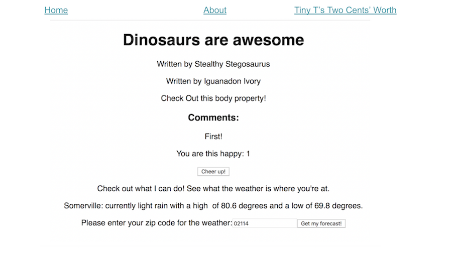

##  {.separator}
<h1>React Router: Section Recap and Exercise</h1>

---

## Recap

What have we learned so far?

* Single Page Applications have specific URLs that are routed to display
  different content.
* React Router is a third-party library that we can install and use with React.
* Since React Router isn't built into React, we must import its components.
* React Router makes it easy for us to route URLs to components.
* React Router automatically manipulates modern browser history mechanics.

Now let's put that to the test!

---

## Try It: Implement Router on Your Dinosaur Blog


Task:

- Create two new pages to your blog:
  - An "About" page (bios of the dino authors)
  - A "Tiny T's Two Cents' Worth" page (Tiny's opinions on the saurian political scene)
  - Get creative and add some fun additional content to these other routes.

- Create a navigation menu of list items that route to each page.


<aside class="notes">

**Talking Points**:

- Each page is a component - we're learning to use React Router here!

**Teaching Tip**:

- This exercise requires students to refactor their `App.js` file.

**Hint**: You'll need multiple `.js` files

**Hint**: Do you have `react-router-dom` installed for this project?

**Hint**: You can instantiate a component with `props` inside of a `<Route>` element.

</aside>

---

## One solution

```js
<Route
  path="/blog"
  component={ () => (
    <Blog
      title={post.title}
      author={post.author}
      body={post.body}
      comments={post.comments}
    />
)}/>
```

**But, wait! This is not the best choice.**

<aside class="notes">

**Talking Points**:
- The above will work, but it is not a great solution; it can create performance issues. [Official React documentation]( https://reacttraining.com/react-router/web/api/Routestates), "When you use component the router uses React.createElement to create a new React element from the given component. That means if you provide an inline function to the component prop, you would create a new component every render. This results in the existing component unmounting and the new component mounting instead of just updating the existing component. When using an inline function for inline rendering, use the render or the children prop.

- So if you’re not supposed to pass a function to component, what’s the solution? Turns out the React Router team predicted this problem and gave us a handy solution. Instead of using component, use the render prop. render accepts a functional component and that function won’t get unnecessarily remounted like with component.
Source: [Tyler Mcginnis](https://tylermcginnis.com/react-router-pass-props-to-components/)

</aside>

---

## A Better Solution

```js
<Route
  path="/blog"
  render={ () => (
    <Blog
      title={post.title}
      author={post.author}
      body={post.body}
      comments={post.comments}
    />
)}/>
```

**Much better!**

<aside class="notes">

**Talking Points**:

- Here's the render prop. Note that the function will also receive all the same props that component would receive. So you can take those and pass those along to the rendered component.

</aside>

---

## Solution




<aside class="notes">

**Talking Point**:

Your solution should look something like what is seen here.

</aside>
