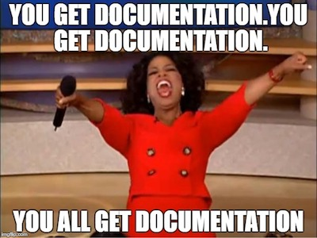
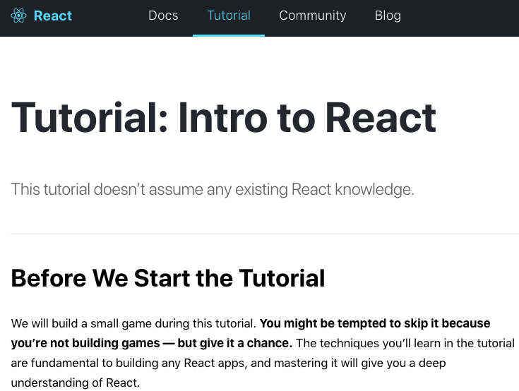
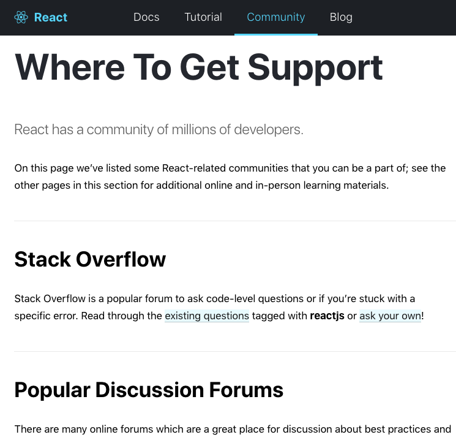
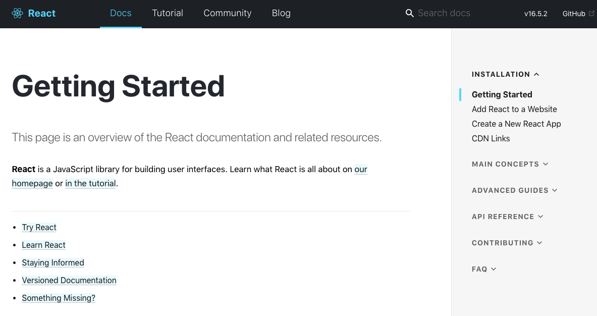
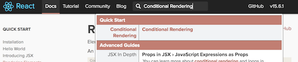

##  {.separator}
<h1>Exploring Documentation</h1>

---

## Learning Objectives

After this lesson, you'll be able to:

- Understand React documentation.
- Apply concepts in the React documentation.

---

## Documentation

 
Image source: https://www.scottturman.com/

<aside class="notes">

**Talking Points**:

- When you don't know how to do something in programming, a great place to check is the documentation. That's what we'll be doing in this lesson — finding the answers in documentation.

- Some frameworks have documentation that's dense and difficult to parse, while others are more straightforward. Luckily, the React.js documentation is one of the more well-written ones.

- You'll be looking at the React documentation to practice learning on your own. This lesson doesn't have a lot of answers because the hope is that you'll be able to find them yourself. We'll be here to point you in the right direction.

</aside>

---

## Looking at the React Website

Because React was created by Facebook, it has a large community with a lot of information.

Open the [React home page](https://facebook.github.io/react/).

<aside class="notes">

**Talking Point**:

- Click "Tutorial" at the top. This is a tutorial to walk you through learning React. It's the tic-tac-toe game that you'll work through later in this unit.

**Teaching Tips:**

- Direct students to open the React home page.

- If that last exercise was a little confusing, it might be worth pausing this lesson to run through the tutorial and reinforce what students have learned so far.

</aside>

---

## The React Community

There are many recommended places to ask for help within "Community."

<aside class="notes">

**Talking Points**:

- Here are some recommended places to ask for help. However, make sure you try your best to find the answer first. Many frameworks don't have such a large community, so being able to find an answer on your own is crucial. Also, while a problem might seem dire, its solution may well be a single command or short explanation found in the documentation.

- That said, looking through questions that have been asked previously is also a great research practice. If you're having a problem, chances are high that someone else has had it, too.

</aside>

---

## The React Documentation

---

## The React Documentation

Click on "Docs."

The navigation bar contains:

- A "Getting Started" guide.
- Main concepts.
- Advanced guides.
- An API reference.

<aside class="notes">

**Talking Points**:

- Let's dive in. Click on "Docs."
- On the right is a navigation bar containing a "Getting Started" guide, main concepts, advanced guides, and an API reference (as well as how to contribute to the documentation, which you could do some day).
- Under "Main Concepts," click "Rendering Elements." Read through the page, paying attention to the examples. Hopefully, this is all review and relatively straightforward.
- Congratulations! You've read a page of React.js documentation.

</aside>

---

## Documentation Exercise: Conditional Rendering

Next, let's apply something new.

Step 1: In the search bar at the top, look for "Conditional Rendering" and read through the page.

Step 2: Referring to the documentation on conditional rendering, finish [this CodePen application](https://codepen.io/SuperTernary/pen/wrooQP) so there's only a single list displayed at any time with a corresponding button that changes between "Show matching fruits" and "Show unmatching fruits."
  - The two functions creating the buttons are included for you below the class declaration.
  - The `return()` method in the `render()` method is accurate, as is the `handleFilterChange()` method. No modifications are needed in either `handleFilterChange()` or `return()`.

When you have it, check your solution against [this CodePen](https://codepen.io/SuperTernary/pen/XeNNEG?editors=0010).

<aside class="notes">

**Talking Points**:

- Now let's apply something new. In the search bar at the top, look for "Conditional Rendering."
- Read through the page.
- Then, look at this CodePen application — it's the fruit filter from before. Currently, it only lists the matching fruits. However, it has functions to make the list for unmatching ones.
- Referring to the documentation on conditional rendering, finish this application so there's only a single list displayed at any time with a corresponding button that changes between "Show matching fruits" and "Show unmatching fruits."
  - The two functions creating the buttons are included for you below the class declaration.
  - The `return()` method in the `render()` method is accurate, as is the `handleFilterChange()` method. No modifications are needed in either `handleFilterChange()` or `return()`.

**Teaching Tip**:

- Provide [this CodePen](https://codepen.io/SuperTernary/pen/qPqqQE?editors=0010) for students who need support. There are comments everywhere they need to make modifications.

</aside>
