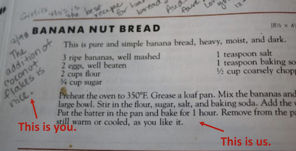

#  Instructor Guide
## React Development

> This document is the source of all knowledge for the course.
----

## Overview
This course introduces students to the basics of the React JavaScript library. In every unit, students engage in hands-on, project-based learning.

React Development students will:

- Explore new concepts and tools through expert-led lectures and discussions.
- Complete coding exercises to reinforce newly learned skills.
- Dive deeper into topics and techniques via programming labs.
- Receive individualized feedback and support from the instructional team.
- Apply what they've learned to build a custom React application.

## Quick Links
- [About This Guide](#about-this-guide)
- [Contributors](#contributors)
- [Course Details](#course-details)
- [Suggested Pacing Guide](#suggested-pacing-guide)
- [Appendix: Materials and Resources](#appendix-materials-and-resources)

## About This Guide

This guide contains links to a standard set of high quality resources for your use in teaching this course. But our goal is not to provide you with a script to follow; we hire practitioners at GA because we value what you bring to the classroom and want to encourage you to make adaptations.
Think of this guide as a cookbook. You, as the chef, will use the guidelines provided to craft an amazing meal for your students. But of course, you’ll want to think ahead about the various “dietary restrictions” and preferences of your “diners” as well as the type of “ambience” best suited to the type of experience you want to create.

Adaptations we encourage you to make:
- **Swapping out our generic examples for real-life examples from your industry experience.** The more you can speak to your own experience, the more the content will resonate with students.
- **Adapting suggested projects and activities to better challenge your students,** based on their level of prior knowledge and their interests.
- **Moving faster or slower as needed through the lessons based on the needs of your class.**

Adaptations you should NOT make:
- **Skipping over or cutting learning objectives.** Our curriculum is designed specifically to prepare students for a career in your industry. We’ve made a promise to them to get them job ready; when you skip content you’re putting their job readiness at risk.
- **Changing the scope of the course.** Do not to add new topics that distract from the core learning.
- **Radically altering the sequence of the course.** It’s okay to skip around sometimes, but try to follow the order of the units suggesting, especially during your first cohort.

>NOTE: If you haven’t already done so, be sure to complete the Instructor Course on myGA. The self-paced course provides a basic background in key concepts necessary for success leading a GA class.

When in doubt, discuss any planned changes to the curriculum you’d like to make with your manager, your fellow instructors, or a Global team member. Chances are, someone else can learn from or be inspired by your improvements!

## Contributors
General Assembly’s course materials are developed in close collaboration with our global expert network. This guide could not have been possible without the contributions of the following current and former instructors, students and community members:

|   |   |   |   |   |
|---|---|---|---|---|
| [Joe Keohan](https://generalassemb.ly/instructors/joe-keohan/7866)     | [Courtney Hoskins](https://generalassemb.ly/instructors/courtney-hoskins/15044)     | [Jamie King](https://generalassemb.ly/instructors/jamie-king/11753)     | [Mike Dang](https://generalassemb.ly/instructors/mike-dang/5451)    | [Sonyl Nagale](https://www.linkedin.com/in/sonyl-nagale-210a634b/)    |
| [Susi Remondi](https://www.linkedin.com/in/susi-remondi-254415b/)     |[Zoe Lubitz](https://www.linkedin.com/in/zoelubitz/)      |  [Emily Logan](https://generalassemb.ly/instructors/emily-logan/10453)    | [Eric Newman](https://www.linkedin.com/in/eric-newman-5895a146/)    | [Jon Zachary](https://generalassemb.ly/instructors/jon-zachary/13535)   |
| [Claire Oliver](https://www.linkedin.com/in/claireoliver/)    | [Jeff Boykin](https://www.linkedin.com/in/jeffboykin/)    | [Tom Trasmontero](https://www.linkedin.com/in/thomas-trasmontero/)     

## Course Details
React Development is a 40-hour course, delivered in either a 1-week full-time or a 10-week part-time (two 2-hour sessions per week) format. Incoming students should have a familiarity with HTML and the Document Object Model (DOM), along with a working knowledge of JavaScript programming and functions, objects, arrays, and classes.

Once enrolled, students complete approximately 4 hours of pre-work on the myGA platform. All pre-work must be finished prior to the first class. As an instructor, you should familiarize yourself with this pre-work so you can review and discuss it in the first lesson.

**Important Note:** All students must complete the blog post code in the props pre-work lesson. If any haven't finished it or have buggy code, work that out during the in-class pre-work review. The Nested Components lecture (which follows the pre-work review) builds off the blog post code.

Your role as an instructor is to facilitate each student’s journey to mastery of the concepts outlined below. This guide includes a suggested pacing guide you can use to ensure you hit all of the required objectives in a sequence that makes sense. **We recommend you follow the suggested pacing guide during your first instance.** Later on, as you become more familiar with the content and your own teaching style, you can remix and extend the lessons provided. Just be sure to cover all of the required topics that follow.

In order to graduate and earn a course completion certificate, every student must complete a final project that meets or exceeds the minimum standards outlined in the project rubric. Your manager will help you track other graduation requirements and make decisions about graduation.

### Learning Objectives
The high-level learning objectives for this course are:

- Explore the essentials of programming with React, including components, JSX, props, and state.
- Build multipage web applications using the popular React Router package.
- Create a custom, functioning web application.
- Embed an application programming interface (API) in a React application.
- Host a React application on Heroku to share with the world.

Students cannot graduate unless they demonstrate mastery of the above learning objectives before the end of the course. Mastery is measured through assessment: homeworks, in-class activities, and final projects.

[The official course syllabus](https://git.generalassemb.ly/react-development/react-development-course-materials/blob/master/Additional-Resources/ReactDevelopmentSyllabi_180907.pdf) outlines what must be covered in the course.

Optional topics you may consider adding on to extend learning (provided your students are ready) include:
- [React Native](https://facebook.github.io/react-native/)
- [Redux](https://redux.js.org/basics/usagewithreact)

### Types of Activities in the React Development Course:

 **Interactive Lectures**:

  - These are lectures that you present to the students. Some have mini code-alongs or exercises baked in. You will also find assets such as videos, charts, and discussion prompts in these lesson decks. **Talking Points** and **Teaching Tips** can be found in the presenter notes (not student-facing). Note that if a student downloads a PDF of these decks, they will not get the presenter notes. Students should be encouraged to take their own notes as they participate in the lecture.

  - Also note that slide content is sparse - each slide displays just a code snippet, an image, a chart, a bulletpoint list. You get to explain the content and expand upon it. There are plenty of notes in the presenter-note field to guide you.
  - [Interactive Lecture Example](https://git.generalassemb.ly/react-development/react-development-course-materials/blob/master/01-React-Key-Concepts/03-nested-components-lecture.md)

 **Exercises**:

  - These are brief coding challenges with student-facing instructions. There are hints and some suggested talking points in the presenter notes (not student facing). Read these over carefully and decide how much info you will provide to the students prior to their starting the exercise.
  - Exercises generally take about 30 minutes to complete.
  - Exercises are the most flexible of the activity types! Use them as solo work, partner work, or group work. Do them in class or assign them as homework. You can even do them as code-alongs.

  - [Exercise Example](https://git.generalassemb.ly/react-development/react-development-course-materials/blob/master/02-React-State/05-to-do-list-part1-exercise.md)

 **Quizzes**:

  - These are sets of auto-graded questions delivered on the myGA platform.
  - Quizzes generally take about 20 minutes to complete and another 10-20 to review.
  - Note that quizzes are NOT a part of the pre-work; they are in a separate learning path. Students will have two tiles on their dashboard — one with all the pre-work lessons (to be completed prior to the start of the course) and one with all the quizzes (to be completed as you assign them throughout the course). As with the pre-work, students will have to log in to their myGA account to access the quizzes.  
  - Feedback is provided after each question.
  - The quizzes are just for review and practice — not important course assessments.
  - Students should note that once the take a quiz, they can't retake it. They WILL be able to access it and review it however.

  - [Quiz Example](https://git.generalassemb.ly/react-development/react-development-course-materials/blob/master/02-React-State/11-react-state-quiz.md)

 **Code-alongs**:

  - These are coding challeneges that students do in class with you. You do it on your laptop and project it on the screen; students follow along on their laptops. The slide decks with the code-along activities provide you with a few slides to project on screen and introduce the topic — like a mini lecture. The rest of the code-along deck is a run-through of the code-along; it's for instructor reference only.
  - There are two designated code-alongs in this course: The Lord of the Rings Code-Along in Unit 1 (approximate time to complete is 30 minutes), and the Idea Board code-along in Unit 6 (approximate time to complete is 60 minutes).
  - [Code-Along Example](https://git.generalassemb.ly/react-development/react-development-course-materials/blob/master/01-React-Key-Concepts/06-lotr-code-along/06-lotr-code-along.md)

 **Labs**:

  - The core curriculum has two labs (ATM and TicTacToe), in which students fork a repo with existing code and add features to it.
  - Labs take approximately 90 minutes to complete.
  - They come at the end of course and assume that the primary course learning objectives have already been covered. They do not have much in the way of textual guidance - students will be very much on their own.
  - You can have students work on these individually or in groups. As they work, you should circulate around the room, providing hints and guidance as needed. Be sure to do a thorough review of the solution when finished.
  - There is an additional lab (Dad Jokes Lab) that is not a part of the core cirriculum. It is included as a resource in case you have some extra time to fill or you have students who are caught up and looking for an additional challenge. Pre-requisitives for the Dad Jokes Lab are: React and React Components, State and Props, The Component Lifecycle, and Working with an API.
  - [Lab Example](https://git.generalassemb.ly/react-development/react-development-course-materials/tree/master/Additional-Resources/ATM%20Lab)

 **Projects**:

  - These are website-building challenges that are done in phases over two or more lessons. Each phase builds upon the next until a final product is assembled.
  - Individual project prompts (to build out one phase or feature of a given project) can be delivered like an exercise. In some cases, it is suggested that they be assigned as homework.
  - There are three projects in this course:
    - Blog Project: This project starts in the [Props pre-work lesson](https://my.generalassemb.ly/preview?lessonURL=https://ga-create-api.s3.amazonaws.com/props-3145.json) and continues through Unit 2.
    - Film project: This one works well as homework. Though we suggest that you at least introduce and begin each phase in class. Let students finish each part at home. Be sure to review the solution for each phase at the next class meeting.
    - Final Project: For this project students build their own website over the course of an entire day (1-week delivery) or a week (10-week delivery). It is very open-ended. Encourage students to start thinking about a topic and focus early on in the course.
       - [Final Project Prompt and Rubric](https://git.generalassemb.ly/react-development/react-development-course-materials/blob/master/06-Applied-Practice/06-final-project-prompt.md)

## Suggested Pacing Guide

### Course Format
This course may be taught online or in-person, in a 10-week or 1-week format.

The schedules for each (linked below) are provided as examples only. Feel free to create the right pace of lessons and activities for your students in order to ensure the required learning objectives are met.

[Pacing Guide](https://docs.google.com/document/d/1VogHvxIbx784mAeS83yI7GNECLYv6WNCGGUe2C5A6W8/edit#)

---

## Appendix: Materials and Resources
- All lesson materials, homeworks and projects outlined in the Suggested Pacing Guide are in this repo.
- All Slides are [here](http://s3.amazonaws.com/react-ga/index.html).
- Standard GA-produced pre-work materials can be accessed on [myGA](https://accounts.generalassemb.ly/users/sign_in).
- Practice quizzes (most units have one) can also be accessed on  [myGA](https://accounts.generalassemb.ly/users/sign_in).
- Labs (in which students fork a repo with existing code and add features to it) are in the Additional Resources folder in this repo.
- Tips and templates for instructors are available on the [GA Instructor Blog](http://assemblyrequired.ga.co).
- For help and support, join the GA Instructors Slack Community and post your questions in #SLACKCHANNEL.

*Copyright 2018, General Assembly Space. Licensed under [CC-BY-NC-SA, 4.0](https://creativecommons.org/licenses/by-nc-sa/4.0/)*
